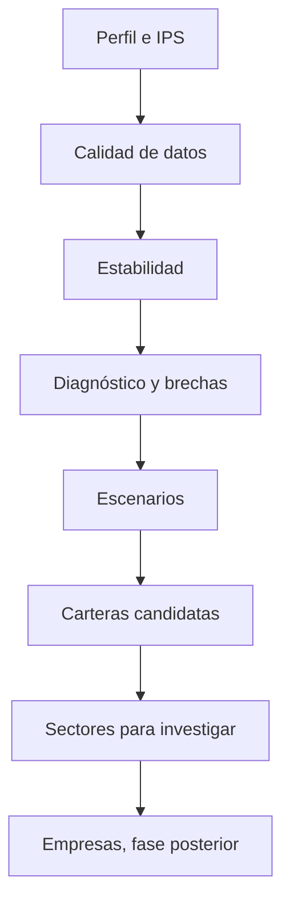
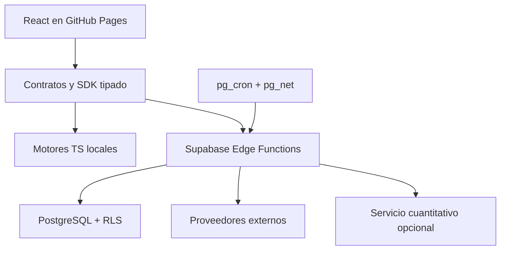
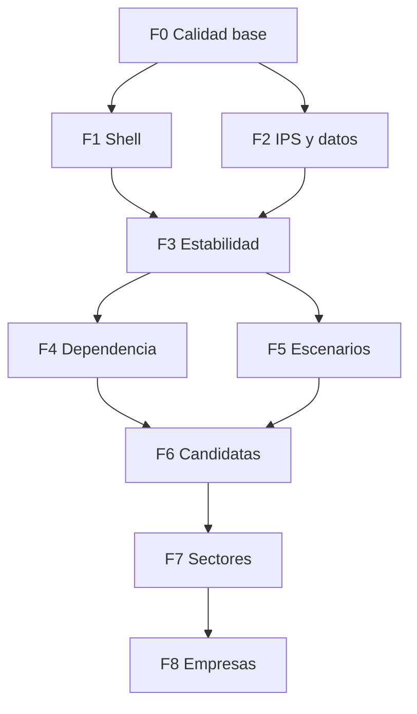

# Plan maestro del Laboratorio

## 0. Ficha del documento

| Campo | Valor |
|---|---|
| Producto | RiskCalculator |
| Iniciativa | Laboratorio de estabilidad, escenarios y oportunidades |
| Repositorio base | `IgnacioR04/RiskCalculator` |
| Despliegue actual | Frontend estático en GitHub Pages |
| Backend actual | Supabase opcional: Auth, PostgreSQL, RLS y Edge Functions |
| Público primario | Inversor particular de largo plazo que aporta parte de su salario |
| Propósito | Ayudar a construir y mantener una cartera coherente con objetivos, riesgo y restricciones |
| Estado | Especificación previa a implementación |
| Versión | 1.0 — 8 de agosto de 2026 |

## 1. Resumen ejecutivo

El Laboratorio será una nueva superficie principal de RiskCalculator que reunirá y ampliará las funciones actuales de Riesgo, Diversificación y Simular. Su arquitectura conceptual tendrá dos mitades:

### A. Estabilidad: «¿Qué tengo y qué puede dañarme?»

Esta mitad explica el presente y el pasado:

- calidad y antigüedad de los datos;
- composición y exposición económica real;
- concentración por activo, emisor, sector, geografía, moneda y factor;
- correlación, covarianza y agrupaciones de activos;
- volatilidad, downside deviation, drawdown, VaR/CVaR con límites claros;
- contribución al riesgo y diversificación efectiva;
- estabilidad de las métricas por ventanas y regímenes;
- pruebas de estrés históricas, paramétricas e hipotéticas;
- desviaciones frente a la política de inversión del usuario.

### B. Escenarios y oportunidades: «¿Qué decisiones merece la pena estudiar?»

Esta mitad mira hacia delante de forma condicional:

- escenarios editables, nunca un único precio futuro;
- reparación priorizada de problemas estructurales;
- carteras candidatas generadas bajo restricciones;
- comparación frente a referencias simples como mantener la cartera o usar pesos iguales;
- incertidumbre, sensibilidad a supuestos y costes de transición;
- señales sectoriales reproducibles, fechadas y explicadas;
- lista de sectores para investigar;
- sugerencias de empresas solo en una fase posterior, tras pasar puertas de calidad, cobertura y cumplimiento.

La secuencia del producto es deliberada:

> Perfil e IPS → calidad de datos → diagnóstico estructural → escenarios → alternativas robustas → oportunidades de investigación.

Una señal de mercado no debe ocultar una concentración excesiva. Si un usuario tiene 50 % en cripto y el resto en tecnología, la primera respuesta del sistema debe explicar la dependencia, los riesgos comunes y las posibles reparaciones; solo después debe mostrar sectores alternativos dignos de estudio.

## 2. Punto de partida real

### 2.1 Capacidades existentes que se reutilizan

El repositorio ya dispone de:

- React 19, TypeScript estricto, Vite 6, React Router, Zustand y Zod;
- gráficos con Recharts;
- cálculos puros para riesgo histórico, covarianza, correlación, contribución de riesgo, concentración, diversificación y estrés;
- proveedor abstracto de datos de mercado;
- Twelve Data mediante proxy seguro, CoinGecko, BCE/Frankfurter, demo y entrada manual;
- modo local persistido sin registro;
- autenticación y sincronización opcionales mediante Supabase;
- tablas con RLS para datos privados y cachés globales para datos de mercado;
- Vitest y Playwright;
- despliegue del frontend con GitHub Actions y GitHub Pages.

Estas piezas deben evolucionar, no duplicarse.

### 2.2 Deuda técnica relevante antes de ampliar

| Hallazgo | Consecuencia | Respuesta del plan |
|---|---|---|
| `HistoricalRiskSection.tsx` concentra adquisición de datos, transformación, cálculo y presentación | Cambiar una métrica puede romper red, estado y UI a la vez | Extraer contratos, hooks, servicios, cálculos y componentes antes de nuevas métricas |
| Un único store de Zustand contiene casi todo el dominio | Migraciones y re-renderizados difíciles de controlar | Crear slices/almacenes de Laboratorio con persistencia versionada |
| El perfil de riesgo actual es una puntuación y categoría simples | No representa capacidad, necesidad, horizonte, liquidez ni restricciones | Introducir IPS versionada y separar tolerancia, capacidad y necesidad |
| El workflow de Pages ejecuta build, pero no todas las puertas de calidad previstas | Una regresión puede desplegarse | Separar CI y despliegue; hacer que el despliegue dependa de las pruebas |
| Riesgo, Diversificación y Simular son rutas independientes | El usuario no recibe una historia decisional común | Integrarlas progresivamente dentro de Laboratorio, conservando redirecciones |
| Los datos sectoriales y de componentes de fondos no tienen proveedor robusto definido | El look-through y las señales pueden ser incompletos | Spike de proveedor, contratos point-in-time, cobertura visible y degradación controlada |
| GitHub Pages solo sirve activos estáticos | No puede guardar claves ni ejecutar optimización pesada | Usar Edge Functions para orquestación y, si hiciera falta, un servicio cuantitativo separado |

### 2.3 Restricciones heredadas que se conservan

1. La calculadora de recuperación y el núcleo educativo siguen funcionando sin cuenta.
2. Los cálculos esenciales deben poder ejecutarse en navegador con datos demo o manuales.
3. Ninguna clave privada llega al bundle.
4. El idioma inicial es español y las fórmulas deben tener explicación legible.
5. La procedencia y frescura de cada dato son visibles.
6. No se fabrican datos para rellenar huecos.
7. La aplicación no promete seguridad ni rentabilidad mínima.
8. Se mantienen enlaces antiguos mediante redirecciones y telemetría de uso antes de retirarlos.

## 3. Visión y resultados medibles

### 3.1 Visión

RiskCalculator debe comportarse como un copiloto analítico: ordena datos, cuantifica riesgos, muestra compromisos y ayuda a investigar alternativas. La decisión final sigue siendo del usuario.

### 3.2 Jobs to be done

| Situación | Necesidad | Resultado del producto |
|---|---|---|
| Aporto dinero cada mes | Saber si el nuevo capital corrige o agrava desequilibrios | Plan de aportación y desviación frente a bandas |
| Mi cartera ha subido mucho | Distinguir rentabilidad de concentración y riesgo asumido | Descomposición de exposición y contribución de riesgo |
| Tengo activos que parecen distintos | Saber si dependen del mismo motor económico | Matriz, clusters, correlación en crisis y factores |
| Temo una caída fuerte | Explorar pérdidas plausibles y capacidad de soportarlas | Escenarios, drawdowns, liquidez y tiempo de recuperación condicional |
| Quiero diversificar | Identificar la carencia más material | Brechas priorizadas y carteras candidatas |
| Quiero saber qué estudiar ahora | Encontrar sectores compatibles sin perseguir ruido | Ranking sectorial con evidencia, incertidumbre y caducidad |

### 3.3 Indicadores de éxito del producto

No se medirán solo clics. Se proponen:

- porcentaje de carteras con calidad de datos suficiente para análisis;
- porcentaje de usuarios que completa una IPS coherente;
- reducción media de concentración o riesgo presupuestado en simulaciones guardadas, no en operaciones reales;
- porcentaje de conclusiones con evidencia y versión de modelo recuperables;
- tasa de escenarios comparados frente a resultado único;
- porcentaje de sugerencias descartadas por filtros explícitos;
- comprensión: usuarios que identifican correctamente la principal fuente de riesgo;
- estabilidad: diferencias entre ejecución repetida con las mismas entradas;
- cobertura y frescura de datos por universo;
- cero exposición de secretos y cero accesos cruzados en pruebas de RLS.

Las métricas de negocio o uso nunca deben incentivar recomendaciones más agresivas.

## 4. Alcance funcional

### 4.1 Incluido

- Nueva navegación `/laboratorio` con las dos áreas.
- IPS ampliada, versionada y separada del cuestionario visual.
- Panel de calidad de datos.
- Exposiciones directas y look-through cuando la fuente lo permita.
- Métricas de estabilidad, dependencia, riesgo y estrés.
- Reutilización y refactorización de cálculos actuales.
- Escenarios y comparación de carteras candidatas.
- Optimización robusta con referencias sencillas y restricciones.
- Señales sectoriales con pipeline reproducible.
- Evidencia, explicaciones, auditoría y versiones.
- CI/CD, RLS, pruebas numéricas, observabilidad y despliegue.
- Modo demo/local y degradación cuando no hay backend o datos en vivo.

### 4.2 Excluido del primer lanzamiento

- Ejecución de órdenes y conexión operativa con brókeres.
- Custodia de fondos.
- Garantías de rentabilidad.
- Pronóstico puntual de precios mediante IA.
- Chat que modifique pesos sin pasar por el motor cuantitativo.
- Optimización fiscal completa por jurisdicción.
- Intradía o trading de alta frecuencia.
- Derivados complejos, opciones y griegas en el MVP.
- Recomendaciones de empresas en producción antes de aprobar la puerta G7.
- Crowdsourcing de opiniones o copy-trading.

### 4.3 Posibles ampliaciones posteriores

- Pasivos, vivienda y pensión para una visión patrimonial.
- Modelos de pasivo/objetivo y glide paths.
- Simulación de retiradas.
- Inflación por cesta y objetivos reales.
- Optimización fiscal específica de España.
- Integraciones de solo lectura con brókeres.
- Factores climáticos o de sostenibilidad con fuente licenciada.

## 5. Taxonomía obligatoria de resultados

Toda tarjeta, tabla, exportación o explicación debe mostrar su categoría:

| Tipo | Definición | Ejemplo | Requisitos |
|---|---|---|---|
| Hecho | Observación directa | Peso de BTC: 50 % | Fuente, fecha y moneda |
| Estimación | Resultado estadístico | Volatilidad anualizada: 31 % | Ventana, método, frecuencia e incertidumbre |
| Escenario | Condición hipotética | «Si cripto cae 35 %...» | Supuestos editables y resultado condicional |
| Señal | Indicador calculado | Momentum sectorial positivo | Fórmula, normalización, fecha, versión y cobertura |
| Sugerencia | Objeto para investigar | «Salud merece revisión» | Motivos a favor/en contra, filtros, caducidad |
| Candidata | Asignación comparativa | Cartera de mínima varianza | Restricciones, costes, sensibilidad; nunca «cartera perfecta» |

No se permiten encabezados como «Esto ocurrirá», «Compra», «Activo seguro» o «Rentabilidad garantizada».

## 6. Arquitectura de producto



### 6.1 Nivel 1: entrada

- cartera actual o cartera demo;
- cuentas y transacciones;
- perfil e IPS;
- configuración de moneda, costes e hipótesis;
- datos de mercado y metadatos.

### 6.2 Nivel 2: datos normalizados

- posiciones a fecha;
- precios, FX y calendario;
- clasificación de activos;
- exposiciones de fondos con fecha de vigencia;
- series históricas alineadas;
- indicadores de calidad y cobertura.

### 6.3 Nivel 3: motores

- motor de estabilidad;
- motor de dependencia;
- motor de escenarios;
- motor de restricciones y carteras candidatas;
- motor de señales sectoriales;
- motor de evidencia y explicaciones.

### 6.4 Nivel 4: resultados inmutables

Cada ejecución registra:

- hash o referencia de la cartera;
- instante de valoración;
- fuentes y cortes de datos;
- supuestos;
- versión de código y modelo;
- resultados estructurados;
- advertencias y cobertura;
- expiración o criterio de obsolescencia.

### 6.5 Nivel 5: experiencia

- resumen decisional;
- exploradores y tablas;
- comparaciones;
- drawers de evidencia;
- historial de ejecuciones;
- exportación.

## 7. Arquitectura técnica objetivo



### 7.1 Frontera del frontend

Responsabilidades:

- entrada y validación inmediata;
- cálculos pequeños y reproducibles;
- visualización;
- caché local de resultados no sensibles;
- modo demo/manual;
- envío de solicitudes autenticadas;
- nunca contener secretos ni lógica de acceso privilegiado.

### 7.2 Frontera de Supabase

Responsabilidades:

- identidad, autorización y RLS;
- persistencia privada;
- proxy a proveedores con claves;
- materialización y cacheado de datos permitidos;
- orquestación de runs;
- tareas programadas;
- auditoría.

### 7.3 Servicio cuantitativo opcional

Solo se introduce si los requisitos superan un motor TypeScript razonable. Casos:

- optimización convexa compleja;
- universos grandes;
- backtests extensos;
- librerías numéricas especializadas.

Debe desplegarse separado de GitHub Pages y no asumirse que Supabase Edge Functions ejecuta Python. La Edge Function autentica, valida, limita y llama al servicio mediante credenciales de servicio de corta vida o secreto en Vault. Este servicio es una decisión de fase, no una dependencia del MVP.

## 8. Principios cuantitativos

1. **Baselines antes que sofisticación.** Comparar cualquier optimizador con cartera actual, mantener pesos, 1/N y límites simples.
2. **Riesgo como distribución.** No reducirlo a una única volatilidad.
3. **Estimación regularizada.** Usar shrinkage para covarianzas y limitar libertad.
4. **Restricciones reales.** Pesos, bandas, liquidez, rotación, costes, activos bloqueados y divisas.
5. **Robustez sobre óptimo aparente.** Favorecer soluciones estables ante cambios pequeños.
6. **Separación de predicción y asignación.** Una señal no decide el peso directamente.
7. **Validación temporal.** Solo información disponible en cada fecha.
8. **Datos point-in-time.** Evitar sesgo de supervivencia y revisiones futuras.
9. **Incertidumbre visible.** Rangos, sensibilidad y estabilidad.
10. **Reproducibilidad.** Mismas entradas y versión producen el mismo resultado.

## 9. Principios de idoneidad y seguridad del usuario

El perfil no puede resumirse en «conservador, moderado o dinámico». Debe separar:

- tolerancia psicológica;
- capacidad financiera de asumir pérdidas;
- necesidad de rentabilidad;
- horizonte;
- liquidez y fondo de emergencia;
- dependencia de ingresos;
- objetivos y prioridad;
- conocimientos y experiencia;
- restricciones legales, éticas, fiscales o personales.

La restricción efectiva de riesgo será la más conservadora entre la tolerancia y la capacidad, salvo revisión explícita. Si la rentabilidad necesaria es incompatible con la capacidad, el sistema no debe elevar el riesgo automáticamente: debe mostrar el conflicto y alternativas como aumentar aportación, alargar horizonte o reducir objetivo.

Esto toma como referencia los elementos de idoneidad del [artículo 25 de MiFID II recopilado por ESMA](https://www.esma.europa.eu/publications-and-data/interactive-single-rulebook/mifid-ii/article-25-assessment-suitability-and), sin afirmar que una aplicación educativa satisfaga por sí sola obligaciones regulatorias.

## 10. Estrategia de migración de navegación

### 10.1 Estado objetivo

- `/laboratorio`: portada y estado general.
- `/laboratorio/estabilidad/*`: presente y pasado.
- `/laboratorio/futuro/*`: escenarios y oportunidades.
- `/perfil`: identidad, cuestionario e IPS, enlazado desde Laboratorio.

### 10.2 Compatibilidad

| Ruta actual | Ruta objetivo inicial | Acción |
|---|---|---|
| `/riesgo` | `/laboratorio/estabilidad/riesgo` | Redirección y aviso temporal |
| `/diversificacion` | `/laboratorio/estabilidad/exposicion` | Redirección |
| `/simular` | `/laboratorio/futuro/escenarios` | Redirección |

El contenido no se mueve todo en una entrega. Primero se crea el shell, luego se incrustan las vistas actuales mediante adaptadores, después se refactorizan.

### 10.3 Navegación móvil

El límite actual de cinco accesos debe revisarse. El Laboratorio sustituye los accesos separados de Riesgo y otras herramientas, liberando espacio. Propuesta:

- Resumen;
- Calculadora;
- Cartera;
- Laboratorio;
- Perfil.

## 11. Fases y puertas de decisión

| Fase | Objetivo | Entregable principal | Puerta de salida |
|---:|---|---|---|
| 0 | Congelar contratos y establecer calidad | ADR, fixtures y CI completo | G0: build y tests deterministas |
| 1 | Crear el shell del Laboratorio | Rutas, navegación y compatibilidad | G1: ninguna función actual perdida |
| 2 | Modelar IPS y calidad de datos | Perfil ampliado y contratos | G2: migraciones/RLS aprobadas |
| 3 | Refactorizar estabilidad histórica | Motor separado de UI | G3: paridad numérica con versión actual |
| 4 | Añadir exposición y dependencia | Look-through, clusters, riesgo en crisis | G4: cobertura explícita y sin datos inventados |
| 5 | Construir escenarios | Biblioteca y editor de escenarios | G5: resultados reproducibles y etiquetados |
| 6 | Generar carteras candidatas | Baselines y optimización robusta | G6: supera o contextualiza 1/N fuera de muestra |
| 7 | Añadir señales sectoriales | Ranking de investigación | G7: validación point-in-time, estabilidad y revisión |
| 8 | Evaluar empresas | Watchlist explicada | G8: proveedor y cumplimiento aprobados |
| 9 | Cerrar evidencia y auditoría | Historial, versiones y explicación | G9: trazabilidad extremo a extremo |
| 10 | Endurecer y lanzar | Seguridad, rendimiento, accesibilidad | G10: checklist de producción completo |

Una puerta puede concluir «no avanzar». Por ejemplo, si las señales sectoriales no son estables fuera de muestra, el producto conserva escenarios y carteras candidatas, pero no publica rankings.

## 12. Dependencias críticas



Además:

- F4 depende de elegir o limitar el proveedor de holdings/clasificaciones.
- F6 depende de fijar costes y restricciones.
- F7 depende de datos point-in-time y de un protocolo de backtest.
- F8 depende de fundamentales, acciones corporativas y universo histórico fiables.
- F9 y F10 atraviesan todas las fases, aunque cierren al final.

## 13. Protocolo de ejecución para una IA

### 13.1 Unidad de trabajo

La unidad es una tarea LAB-xxx del backlog. No una fase completa.

Una tarea ideal:

- produce una capacidad observable o una refactorización con paridad;
- tiene dependencias explícitas;
- limita el número de conceptos nuevos;
- incluye pruebas;
- puede revertirse sin perder datos;
- no mezcla un cambio grande de esquema con una UI grande y un modelo nuevo.

### 13.2 Secuencia por tarea

1. **Orientación**
   - Leer la tarea y sus referencias.
   - Inspeccionar `package.json`, rutas, contratos y archivos afectados.
   - Comprobar cambios ajenos en el worktree.
2. **Diseño local**
   - Confirmar entradas, salidas y estados de error.
   - Identificar si hace falta ADR o migración.
   - Proponer el mínimo cambio vertical.
3. **Implementación**
   - Crear tipos y validaciones antes de la UI.
   - Mantener funciones cuantitativas puras.
   - Separar llamadas externas.
   - Añadir instrumentación sin datos sensibles.
4. **Verificación**
   - Pruebas unitarias y de contrato.
   - Prueba integrada si toca persistencia o red.
   - E2E solo para recorrido de usuario.
   - `npm run lint`, `npm run typecheck`, `npm test`, `npm run build`.
5. **Entrega**
   - Resumir comportamiento, no solo archivos.
   - Anotar límites y deuda introducida.
   - Adjuntar evidencia de pruebas.
   - No declarar completada la tarea si falta un criterio.

### 13.3 Plantilla de solicitud de implementación

```md
Implementa LAB-XXX.

Contexto:
- Lee 00, la sección UX indicada, el contrato de 02 y las pruebas de 05.
- Conserva modo local, HashRouter y compatibilidad de rutas.

Alcance:
- ...

No incluido:
- ...

Archivos esperados:
- ...

Pruebas obligatorias:
- ...

Criterios de aceptación:
- ...
```

### 13.4 Regla de parada

La IA debe detenerse y pedir una decisión si:

- el proveedor no concede el uso o almacenamiento necesario;
- una migración exige destruir o reinterpretar datos;
- una credencial o permiso no está disponible;
- dos documentos del plan se contradicen materialmente;
- la métrica no tiene definición o tolerancia numérica;
- la interfaz podría convertir una sugerencia educativa en asesoramiento personalizado;
- el coste operativo supera el presupuesto no definido;
- los resultados de validación no cumplen la puerta de la fase.

## 14. Definition of Ready

Una tarea está preparada cuando:

- tiene identificador, responsable y fase;
- sus dependencias están completadas;
- entradas y salidas están definidas;
- existen fixtures o se sabe cómo obtenerlos;
- se ha decidido el comportamiento sin datos, con datos caducados y con error;
- se conocen archivos o módulos candidatos;
- existen criterios de aceptación comprobables;
- cualquier migración tiene rollback lógico o plan de compatibilidad;
- no depende de una decisión abierta no resuelta.

## 15. Definition of Done

Una tarea está terminada cuando:

- cumple todos los criterios funcionales;
- no rompe rutas ni datos existentes;
- valida entradas con Zod en la frontera;
- contiene pruebas con tolerancias explícitas;
- trata loading, vacío, parcial, stale, error y demo cuando apliquen;
- mantiene accesibilidad por teclado y lectores;
- no registra PII, tokens ni carteras completas en logs;
- actualiza documentación y ADR si corresponde;
- supera las puertas CI relevantes;
- el resultado puede reproducirse con versión e inputs;
- la revisión confirma que el lenguaje no promete ni recomienda indebidamente.

## 16. Estrategia de versiones y compatibilidad

### 16.1 Store local

- Incrementar `STORE_VERSION` únicamente con migrador explícito.
- Mantener lectura de la versión anterior durante al menos una versión estable.
- Separar datos del Laboratorio de preferencias visuales.
- No persistir series de mercado grandes en localStorage; usar IndexedDB o caché controlada.
- Ofrecer exportación antes de cualquier migración no reversible.

### 16.2 Base de datos

- Todas las migraciones son aditivas.
- Columnas nuevas comienzan anulables o con defaults seguros.
- Backfill separado de la migración estructural.
- RLS y tests se añaden en el mismo cambio.
- Lectura dual antes de cambiar escritura cuando exista información antigua.
- Retirada de campos solo después de telemetría y ventana de compatibilidad.

### 16.3 API

- Versionar contratos de runs y resultados.
- Mantener respuestas anteriores durante migración.
- Incluir `schemaVersion`, `modelVersion` y `asOf`.
- Los clientes deben ignorar campos desconocidos, pero rechazar versiones mayores incompatibles.

## 17. Decisiones arquitectónicas que deben documentarse

Crear ADR para:

- ADR-001: arquitectura del Laboratorio y límites del frontend;
- ADR-002: modelo IPS y regla de riesgo efectiva;
- ADR-003: persistencia local, IndexedDB y sincronización;
- ADR-004: proveedor de clasificaciones y look-through;
- ADR-005: representación de runs analíticos;
- ADR-006: motor TypeScript frente a servicio cuantitativo;
- ADR-007: metodología de carteras candidatas;
- ADR-008: metodología y gobierno de señales sectoriales;
- ADR-009: política de explicaciones y uso de LLM;
- ADR-010: despliegue y promoción de entornos.

Cada ADR debe incluir contexto, decisión, alternativas, consecuencias, riesgos y criterio de revisión.

## 18. Riesgos principales y mitigaciones

| Riesgo | Probabilidad/impacto | Mitigación |
|---|---|---|
| Precisión falsa por datos incompletos | Alta/Alta | Cobertura visible, bloquear resultados no válidos, no imputar silenciosamente |
| Optimización inestable | Alta/Alta | Shrinkage, límites, baselines, sensibilidad, walk-forward |
| Sesgo retrospectivo | Alta/Alta | Point-in-time, timestamps de ingestión y vigencia, universos históricos |
| UI demasiado densa | Media/Alta | Resumen progresivo, máximo de decisiones por pantalla, detalles bajo demanda |
| Recomendación entendida como asesoramiento | Media/Alta | Taxonomía, copy revisado, puerta legal y sugerencias de investigación |
| Coste/rate limit de datos | Alta/Media | Caché, cuotas, colas, proveedor abstracto, modo parcial |
| Fuga de secretos | Baja/Crítica | Edge Functions, Vault, OIDC, permisos mínimos y escaneo |
| Acceso cruzado entre usuarios | Baja/Crítica | RLS por defecto, pruebas negativas y service role aislado |
| Modelo abandonado | Media/Alta | Versionado, ownership, alertas de drift, caducidad automática |
| Ruptura del modo local | Media/Alta | Matriz de capacidades y E2E sin backend |

## 19. Fuentes metodológicas mínimas

Las implementaciones deben leer las fuentes originales pertinentes y documentar desviaciones:

- Markowitz, [Portfolio Selection](https://onlinelibrary.wiley.com/doi/abs/10.1111/j.1540-6261.1952.tb01525.x).
- Ledoit y Wolf, [A well-conditioned estimator for large-dimensional covariance matrices](https://www.ledoit.net/Honey_2004.pdf).
- DeMiguel, Garlappi y Uppal, [Optimal Versus Naive Diversification](https://academic.oup.com/rfs/article-abstract/22/5/1915/1592901).
- Black y Litterman, [Global Portfolio Optimization](https://rpc.cfainstitute.org/research/financial-analysts-journal/1992/faj-v48-n5-28).
- Maillard, Roncalli y Teïletche, [The Properties of Equally Weighted Risk Contribution Portfolios](https://www.thierry-roncalli.com/download/erc.pdf).
- Rockafellar y Uryasev, [Optimization of Conditional Value-at-Risk](https://sites.math.washington.edu/~rtr/papers/rtr179-CVaR1.pdf).
- López de Prado, [Building Diversified Portfolios that Outperform Out of Sample](https://papers.ssrn.com/sol3/papers.cfm?abstract_id=2708678).
- CFA Institute, [Elements of an Investment Policy Statement for Individual Investors](https://rpc.cfainstitute.org/policy/positions/elements-of-an-investment-policy-statement-for-individual-investors).

## 20. Criterio de finalización del programa

El programa completo se considera finalizado cuando:

1. Las rutas heredadas funcionan o han completado una retirada anunciada.
2. El usuario puede completar IPS y conocer la calidad de sus datos.
3. La estabilidad actual/histórica tiene paridad y más profundidad que la aplicación actual.
4. Los escenarios son condicionales, reproducibles y comparables.
5. Las carteras candidatas incorporan restricciones, costes y sensibilidad.
6. Las señales publicadas han superado validación fuera de muestra y gobierno.
7. Cada conclusión puede rastrearse a datos, fórmula y versión.
8. CI/CD impide desplegar código o migraciones no verificadas.
9. RLS, secretos, privacidad y accesibilidad han sido auditados.
10. Existe rollback probado y manual de incidentes.

La fase de empresas es opcional para considerar exitoso el Laboratorio. Un producto que diagnostica y compara bien es preferible a uno que genera nombres de acciones con evidencia insuficiente.
