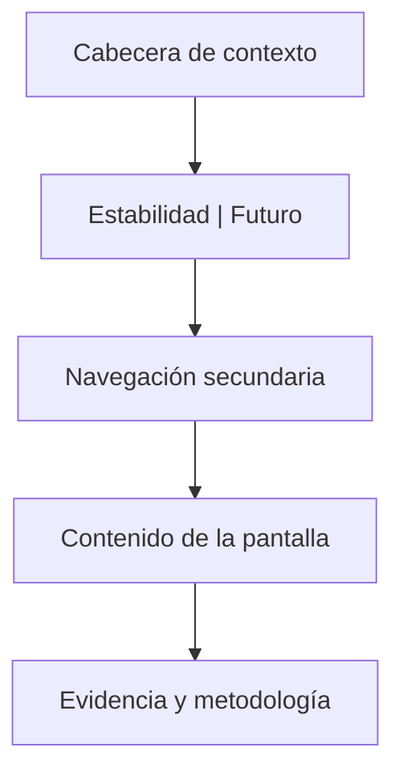

# Especificación de producto y experiencia del Laboratorio

## 1. Objetivo de esta especificación

Este documento define qué verá y hará el usuario. No define las fórmulas internas salvo cuando cambian el significado de una pantalla. Debe utilizarse junto con:

- `00-plan-maestro-laboratorio.md` para alcance y fases;
- `02-arquitectura-cuantitativa-datos.md` para contratos y cálculos;
- `04-backlog-fases-y-tareas-ia.md` para fragmentar la implementación;
- `05-pruebas-seguridad-gobierno-modelos.md` para aceptación.

## 2. Principios de diseño

### 2.1 Una decisión por nivel

Cada pantalla debe responder primero a una pregunta:

- ¿Puedo confiar en el análisis?
- ¿Dónde está mi cartera?
- ¿Qué riesgo domina?
- ¿Qué pasa si cambia una condición?
- ¿Qué alternativas son coherentes?
- ¿Qué debería investigar?

Los detalles matemáticos se revelan progresivamente. El resumen no puede convertirse en una tabla de veinte ratios.

### 2.2 Evidencia antes que persuasión

Toda conclusión tiene acceso a:

- dato o cálculo que la sustenta;
- fecha y ventana;
- fuente;
- cobertura;
- versión de modelo;
- supuestos;
- limitaciones.

### 2.3 Reparar antes de perseguir

Si existen alertas estructurales críticas, la portada de Futuro muestra primero «Reparar la cartera». Las señales sectoriales siguen accesibles, pero nunca como la acción principal.

### 2.4 Comparar, no ordenar

La aplicación presenta alternativas comparables. Deben evitarse frases como:

- «La cartera óptima es...»
- «Debes comprar...»
- «Este sector va a subir...»

Se admiten:

- «Esta candidata reduce la concentración estimada bajo estos supuestos».
- «Este sector supera los filtros de investigación definidos».
- «Si el escenario se materializara, la pérdida estimada sería...».

### 2.5 Incertidumbre visible

Un resultado futuro no se representa como un único número grande. Se emplean:

- intervalos o percentiles;
- abanicos de escenarios;
- sensibilidad;
- estabilidad de pesos;
- advertencias de baja cobertura.

### 2.6 El color no es el significado

Ganancia/pérdida, riesgo y alertas se comunican con texto, icono y forma además del color. Los gráficos deben poder leerse con paletas aptas para daltonismo.

## 3. Arquitectura de información

### 3.1 Navegación principal

La navegación global queda:

1. Resumen
2. Calculadora
3. Cartera
4. Laboratorio
5. Importar — puede quedar en menú secundario en móvil
6. Perfil

En móvil se muestran cinco destinos:

1. Resumen
2. Calculadora
3. Cartera
4. Laboratorio
5. Perfil

Importar se ofrece desde Cartera, el menú «Más» y estados vacíos.

### 3.2 Rutas propuestas

| Ruta | Pantalla |
|---|---|
| `/laboratorio` | Portada y diagnóstico general |
| `/laboratorio/estabilidad` | Resumen de estabilidad |
| `/laboratorio/estabilidad/datos` | Calidad y cobertura |
| `/laboratorio/estabilidad/exposicion` | Exposición y concentración |
| `/laboratorio/estabilidad/dependencia` | Correlaciones, clusters y factores |
| `/laboratorio/estabilidad/riesgo` | Riesgo total y contribuciones |
| `/laboratorio/estabilidad/historico` | Comportamiento por ventanas y regímenes |
| `/laboratorio/estabilidad/estres` | Pruebas de estrés |
| `/laboratorio/futuro` | Resumen de escenarios y decisiones |
| `/laboratorio/futuro/reparar` | Brechas y acciones de estructura |
| `/laboratorio/futuro/escenarios` | Constructor y comparación |
| `/laboratorio/futuro/candidatas` | Carteras candidatas |
| `/laboratorio/futuro/sectores` | Sectores para investigar |
| `/laboratorio/futuro/empresas` | Empresas para investigar, tras G8 |
| `/laboratorio/runs/:runId` | Resultado histórico reproducible |
| `/laboratorio/comparaciones/:id` | Comparación guardada |

Con HashRouter, la URL pública será del tipo:

`https://ignacior04.github.io/RiskCalculator/#/laboratorio/estabilidad`

### 3.3 Redirecciones

- `/riesgo` → `/laboratorio/estabilidad/riesgo`
- `/diversificacion` → `/laboratorio/estabilidad/exposicion`
- `/simular` → `/laboratorio/futuro/escenarios`

Durante una versión se puede mostrar un banner discreto «Esta herramienta ahora está dentro de Laboratorio» con opción de cerrar.

## 4. Shell del Laboratorio

### 4.1 Estructura



### 4.2 Cabecera de contexto persistente

Debe mostrar:

- cartera seleccionada;
- fecha de valoración;
- moneda base;
- perfil de riesgo efectivo;
- estado de IPS: completa, incompleta o caducada;
- calidad de datos: suficiente, parcial o insuficiente;
- último cálculo;
- botón «Actualizar análisis».

Interacciones:

- cambiar cartera sin salir;
- abrir configuración de IPS;
- abrir panel de calidad;
- elegir fecha si existen snapshots;
- crear un run nuevo;
- acceder a historial de runs.

No debe volver a calcular silenciosamente cuando el usuario está leyendo un resultado guardado. Si llegan datos nuevos, se muestra «Hay datos más recientes; recalcular».

### 4.3 Selector Estabilidad/Futuro

Debe ser visible como dos pestañas o segmentos de primer nivel:

- **Estabilidad** — «Presente y pasado».
- **Escenarios y oportunidades** — «Futuros posibles».

En móvil, las subrutas aparecen en un selector desplegable con título actual y no en una tira horizontal interminable.

## 5. Portada `/laboratorio`

### 5.1 Pregunta

«¿Cuál es la situación más importante de mi cartera y qué puedo explorar después?»

### 5.2 Jerarquía

1. Estado del análisis.
2. Tres conclusiones máximas.
3. Puente Estabilidad/Futuro.
4. Acciones recomendadas dentro del producto.
5. Historial reciente.

### 5.3 Componentes

#### A. LabReadinessCard

Campos:

- estado de cartera;
- cobertura histórica;
- cobertura de clasificación;
- IPS;
- freshness;
- bloqueos.

Estados:

- «Listo para análisis completo».
- «Análisis parcial: faltan holdings de dos ETF».
- «No listo: no hay transacciones o posiciones».

Acción primaria contextual: «Completar datos», «Completar perfil» o «Actualizar».

#### B. KeyFindings

Máximo tres hallazgos ordenados por materialidad:

- concentración crítica;
- activo con mayor contribución a riesgo;
- dependencia que aumenta en caídas;
- restricción de IPS incumplida;
- datos insuficientes.

Cada hallazgo muestra:

- título factual;
- una métrica principal;
- por qué importa;
- confianza/cobertura;
- enlace «Ver evidencia».

#### C. TwoWorldsCard

Dos accesos paralelos:

- «Entender mi estabilidad».
- «Explorar escenarios».

#### D. NextBestAnalysis

Acciones internas, no órdenes financieras:

- «Revisar concentración por sector».
- «Comparar escenario de caída tecnológica».
- «Completar el horizonte del objetivo».

#### E. RecentRuns

Lista de ejecuciones:

- fecha;
- tipo;
- snapshot;
- modelo;
- estado;
- abrir/comparar.

## 6. Área Estabilidad

## 6.1 Resumen de estabilidad

### Pregunta

«¿Cuáles son las fuentes dominantes de riesgo y cuán estable es el diagnóstico?»

### Tarjetas principales

1. **Riesgo dominante**
   - activo/sector/factor;
   - contribución porcentual;
   - cambio respecto a ventana anterior.
2. **Concentración**
   - HHI;
   - número efectivo de posiciones;
   - principal exposición look-through.
3. **Dependencia**
   - correlación media;
   - correlación en mercados bajistas;
   - cluster dominante.
4. **Pérdida histórica**
   - máximo drawdown;
   - fecha y duración;
   - estado actual de recuperación.

### Sección «Estabilidad de la medición»

Debe indicar si la conclusión cambia al usar:

- 1, 3 y 5 años;
- retornos semanales frente a diarios;
- covarianza muestral frente a shrinkage;
- exclusión de activos con baja historia.

La interfaz resume: estable, sensible o no concluyente.

## 6.2 Calidad de datos

### Pregunta

«¿Qué datos sostienen el análisis y qué falta?»

### Tabla de cobertura por activo

Columnas:

- activo;
- precio;
- FX;
- historia;
- clasificación;
- holdings/look-through;
- fundamentales, si aplica;
- última actualización;
- fuente;
- estado.

### Reglas visuales

- «No disponible» nunca equivale a cero.
- Las imputaciones, si se permiten en una métrica concreta, se marcan.
- El usuario puede excluir un activo del análisis, pero ve el porcentaje excluido.
- Un resultado que cubre menos del umbral definido debe quedar bloqueado o degradado.

### Acciones

- actualizar;
- introducir manualmente;
- mapear ticker/mercado;
- corregir moneda;
- excluir;
- leer limitaciones del proveedor.

## 6.3 Exposición y concentración

### Pregunta

«¿Dónde está invertido realmente mi dinero?»

### Vistas

- por posición;
- por emisor;
- por tipo de activo;
- por sector;
- por industria;
- por país/región;
- por moneda económica;
- por factor, cuando esté disponible;
- directa frente a look-through.

### Visuales

- barras ordenadas para comparaciones exactas;
- treemap solo como vista complementaria;
- tabla como fuente accesible;
- gráfico «directo vs real» para ETF/fondos;
- concentración acumulada de top 1/3/5/10;
- doble contabilización o solapamiento.

### Métricas

- HHI;
- número efectivo;
- participación máxima;
- top-N;
- concentración por bucket;
- solapamiento par a par;
- cobertura del look-through.

### Interacción

Al seleccionar una exposición, se resaltan posiciones que la originan. Ejemplo: «Tecnología 49 %» despliega qué acciones y holdings de ETF contribuyen.

## 6.4 Dependencia

### Pregunta

«¿Cuántas fuentes de comportamiento diferentes tengo?»

### Secciones

1. Matriz de correlación ordenable.
2. Clusters de dependencia.
3. Correlación rolling.
4. Correlación en subidas y bajadas.
5. Correlación de cola si la muestra lo permite.
6. Exposición a factores.

### Matriz

Controles:

- ventana;
- frecuencia;
- retornos simples/log;
- moneda base;
- método;
- activos o grupos.

La diagonal no necesita protagonismo. La ordenación por clustering debe ser la predeterminada para carteras grandes.

### ClusterCard

Muestra:

- integrantes;
- peso de capital;
- contribución al riesgo;
- exposición común;
- estabilidad del cluster.

No nombrar automáticamente un cluster como «tecnología» si el dato no lo justifica; usar «Grupo 1» y explicar correlaciones.

## 6.5 Riesgo

### Pregunta

«¿Cuánto puede variar o caer la cartera y quién aporta ese riesgo?»

### Métricas, con niveles

Nivel principal:

- volatilidad anualizada;
- downside deviation;
- máximo drawdown;
- CVaR histórico;
- contribución de riesgo del mayor componente.

Nivel avanzado:

- VaR;
- tracking error frente a referencia elegida;
- beta y sensibilidad;
- semivarianza;
- ulcer index;
- tiempo bajo agua;
- liquidez aproximada, solo si hay datos.

### ContributionExplorer

Alterna:

- peso de capital;
- contribución absoluta;
- contribución porcentual;
- contribución marginal.

Debe explicar casos contraintuitivos: un activo puede tener peso bajo y contribución alta; una contribución puede ser negativa por cobertura.

### Advertencias

- VaR no es la pérdida máxima.
- Normalidad, historia y frecuencia son supuestos.
- Cripto y colas gruesas requieren especial cautela.

## 6.6 Histórico y regímenes

### Pregunta

«¿Cómo se comportó el riesgo en distintos periodos?»

### Vistas

- valor normalizado;
- drawdown;
- volatilidad rolling;
- correlación rolling;
- contribución rolling;
- periodos de estrés;
- retornos mensuales/anuales;
- comparación contra referencia configurable.

### Regímenes

La aplicación puede mostrar:

- etiquetas basadas en reglas transparentes;
- periodos históricos seleccionados;
- clusters estadísticos solo si están validados.

No debe afirmar causalidad. «Durante periodos etiquetados como inflación alta...» es válido; «la inflación causó...» requiere análisis distinto.

## 6.7 Estrés

### Pregunta

«¿Qué ocurriría bajo una perturbación definida?»

### Biblioteca

- caídas históricas con fechas;
- shocks por activo;
- shocks por sector;
- shocks por factor;
- shocks de tipos;
- shocks de FX;
- shock combinado;
- escenario personalizado.

### Resultado

- pérdida total;
- contribución por posición;
- brechas de liquidez;
- restricciones vulneradas;
- supuestos;
- comparación con capacidad de pérdida.

El estrés nunca se guarda como «predicción». Se guarda como escenario con definición y versión.

## 7. Área Escenarios y oportunidades

## 7.1 Portada Futuro

### Pregunta

«¿Qué decisiones puedo explorar sin confundir escenario con pronóstico?»

### Orden de contenido

1. Conflictos entre IPS y cartera.
2. Reparaciones estructurales.
3. Escenarios guardados.
4. Carteras candidatas.
5. Sectores para investigar.
6. Empresas, si la funcionalidad está habilitada.

### FutureGuardrail

Banner permanente, conciso:

«Los resultados son escenarios y señales basadas en datos pasados y supuestos. No predicen el mercado ni sustituyen asesoramiento profesional.»

## 7.2 Reparar

### Pregunta

«¿Qué desequilibrio conviene estudiar primero?»

### Motor de brechas

Ordena:

1. violaciones duras de IPS;
2. riesgo de liquidez;
3. concentración;
4. dependencia;
5. costes/rotación;
6. desviación de objetivo;
7. oportunidad táctica.

### RepairCard

Campos:

- brecha;
- evidencia;
- severidad;
- restricción relacionada;
- opciones de reparación;
- impacto estimado;
- efectos secundarios;
- botón «Simular, no aplicar».

Ejemplo:

> «Cripto representa 50 % del capital y 71 % del riesgo estimado. Tu banda configurada es 0–15 %. Simula aportaciones a clases menos dependientes o una reducción gradual.»

La aplicación no ejecuta la acción.

## 7.3 Constructor de escenarios

### Flujo

1. Elegir plantilla o empezar vacío.
2. Definir horizonte.
3. Añadir shocks o supuestos.
4. Elegir si hay aportaciones/rebalanceo.
5. Validar coherencia.
6. Ejecutar.
7. Comparar.
8. Guardar.

### Entradas

- retornos por activo/clase/sector;
- volatilidad y correlación;
- FX;
- inflación;
- tipos;
- aportación mensual;
- rebalanceo;
- costes;
- horizonte;
- semilla si hay simulación.

### Resultados

- distribución terminal;
- drawdown;
- probabilidad estimada de cumplir objetivo;
- pérdida en percentiles;
- contribuciones;
- ruta de aportaciones;
- sensibilidad;
- advertencias.

Si la metodología no permite probabilidades calibradas, la UI usa «porcentaje de trayectorias simuladas», no «probabilidad real».

## 7.4 Carteras candidatas

### Pregunta

«¿Qué asignaciones cumplen mis restricciones y cómo cambian los compromisos?»

### Candidatas mínimas

- cartera actual;
- sin cambios;
- aportaciones solamente;
- pesos iguales entre activos elegibles;
- mínima varianza restringida;
- equal risk contribution;
- Black-Litterman/robusta si se habilita;
- candidata manual.

### Tabla comparativa

| Dimensión | Actual | Aportaciones | 1/N | Mín. varianza | ERC |
|---|---:|---:|---:|---:|---:|
| Retorno esperado | rango | rango | rango | rango | rango |
| Volatilidad | valor | valor | valor | valor | valor |
| CVaR | valor | valor | valor | valor | valor |
| Máx. peso | valor | valor | valor | valor | valor |
| Número efectivo | valor | valor | valor | valor | valor |
| Rotación | 0 | valor | valor | valor | valor |
| Coste estimado | 0 | valor | valor | valor | valor |
| Violaciones | n | n | n | n | n |

### Controles

- fijar activos;
- excluir activos;
- límites min/max;
- bandas por clase;
- máximo turnover;
- mínimo efectivo;
- objetivo de riesgo;
- costes;
- permitir solo aportaciones;
- restricción de moneda/liquidez.

### Estabilidad de solución

Para cada candidata:

- rango de peso bajo perturbaciones;
- activos que entran/salen con facilidad;
- distancia a la cartera actual;
- sensibilidad a retornos esperados;
- indicación «estable/sensible».

No ocultar soluciones de esquina.

## 7.5 Sectores para investigar

### Pregunta

«¿Qué sectores superan filtros objetivos y encajan como objeto de investigación?»

### Cabecera

- universo;
- región;
- fecha;
- horizonte de señal;
- versión;
- cobertura;
- estado de mercado;
- caducidad.

### Filtros previos

- disponibilidad y calidad de datos;
- liquidez;
- concentración actual;
- restricción de IPS;
- exposición look-through;
- moneda;
- universo permitido;
- conflictos.

### Ranking

Cada fila muestra:

- sector;
- puntuación total;
- subpuntuaciones;
- incertidumbre;
- relación con la cartera;
- peso actual real;
- razones a favor;
- razones en contra;
- riesgos;
- caducidad;
- acción «Investigar».

Subpuntuaciones posibles, solo si están aprobadas:

- valoración relativa;
- momentum;
- calidad;
- crecimiento/revisiones;
- estabilidad;
- diversificación marginal;
- sensibilidad macro;
- crowding/concentración;
- calidad de datos.

### CompareSectorDrawer

Permite comparar hasta tres sectores:

- exposición ya existente;
- correlación con cartera;
- contribución marginal estimada;
- comportamiento histórico en regímenes;
- datos fundamentales agregados;
- costes y vehículos disponibles;
- evidencia.

### Estado sin señal

Es un resultado válido:

«Ningún sector cumple hoy los filtros de cobertura, estabilidad y compatibilidad. Revisa los criterios o vuelve a calcular cuando haya datos nuevos.»

## 7.6 Empresas para investigar

Solo aparece tras G8 y puede permanecer con feature flag.

### Reglas

- primero se elige un sector o universo permitido;
- se aplican filtros de liquidez, calidad, datos y concentración;
- el resultado es una watchlist, no una orden;
- debe mostrar exposición redundante con fondos existentes;
- debe incluir riesgos, controversias de datos y fecha de fundamentales;
- no se permiten objetivos de precio generados por LLM.

### Ficha

- empresa, ticker, mercado y moneda;
- sector/industria;
- calidad de datos;
- factores y fundamentales seleccionados;
- correlación y contribución marginal;
- exposición que añadiría;
- escenarios relevantes;
- razones de inclusión y exclusión;
- enlaces de fuente cuando la licencia lo permita.

## 8. Perfil e IPS

## 8.1 Asistente por pasos

1. Objetivos.
2. Horizonte.
3. Situación financiera y liquidez.
4. Tolerancia.
5. Conocimientos y experiencia.
6. Necesidad de rentabilidad.
7. Restricciones.
8. Reglas de mantenimiento.
9. Revisión y firma educativa.

Debe permitir «Guardar y continuar» sin completar, pero un análisis personalizado indica qué falta.

## 8.2 Resumen IPS

Muestra:

- objetivo prioritario;
- horizonte;
- pérdida máxima tolerada declarada;
- capacidad estimada;
- riesgo efectivo;
- aportación;
- liquidez mínima;
- bandas;
- restricciones;
- frecuencia de revisión;
- fecha de vigencia.

## 8.3 Conflictos

Ejemplos:

- retorno requerido incompatible con riesgo;
- horizonte corto y activos ilíquidos;
- fondo de emergencia insuficiente;
- límite sectorial ya vulnerado;
- experiencia baja y producto complejo.

El sistema explica el conflicto y pide ajustar supuestos. No decide silenciosamente.

## 9. Componentes compartidos

| Componente | Responsabilidad |
|---|---|
| `AsOfBadge` | Fecha de observación y estado fresh/stale |
| `EvidenceDrawer` | Fuentes, metodología, inputs y versión |
| `CoverageMeter` | Cobertura ponderada y huecos |
| `MetricCard` | Métrica, unidad, cambio y explicación |
| `UncertaintyBand` | Rango o sensibilidad |
| `ConstraintChip` | Restricción cumplida/incumplida |
| `ScenarioBadge` | Identifica resultado condicional |
| `ModelVersionLink` | Abre ficha de modelo |
| `DataQualityBanner` | Estado agregado y acción |
| `EmptyState` | Próximo paso explícito |
| `RunStatus` | queued/running/completed/partial/failed/stale |
| `ComparisonTray` | Selección y comparación persistente |
| `MethodologyPanel` | Definiciones y fórmulas accesibles |

Todos deben ser reutilizables y no contener acceso directo a proveedores.

## 10. Estados de interfaz obligatorios

Cada vista asíncrona debe diseñar:

| Estado | Comportamiento |
|---|---|
| Inicial | Explica qué se necesita antes de ejecutar |
| Loading | Skeleton estable; no métricas falsas |
| En cola | Posición/estado si existe job |
| Parcial | Resultados permitidos y huecos visibles |
| Vacío | Acción concreta para añadir/importar |
| Fresh | Fecha y fuente visibles |
| Stale | Se conserva resultado con aviso y recalcular |
| Error recuperable | Motivo legible, reintento y alternativa |
| Error de validación | Campo y corrección |
| Offline | Resultado local o último snapshot, claramente marcado |
| Demo | Banner persistente y datos identificados |
| Manual | Proveniencia manual y fecha del usuario |
| No autorizado | Iniciar sesión o usar modo local |
| Bloqueado | Explica umbral de datos o puerta no superada |

## 11. Lenguaje y microcopy

### 11.1 Vocabulario recomendado

- «riesgo estimado»;
- «bajo estos supuestos»;
- «cartera candidata»;
- «sector para investigar»;
- «cobertura de datos»;
- «resultado sensible»;
- «históricamente»;
- «no concluyente».

### 11.2 Vocabulario prohibido

- «seguro» para un activo con riesgo;
- «garantizado»;
- «el mejor» sin función objetivo y restricciones;
- «predicción fiable»;
- «debes comprar/vender»;
- «riesgo cero»;
- «esta cartera te dará X %».

### 11.3 Plantilla de conclusión

```text
Hecho: [observación con fecha].
Estimación: [métrica, ventana y método].
Interpretación: [por qué importa para la IPS].
Incertidumbre: [cobertura/sensibilidad].
Siguiente análisis: [acción dentro de la aplicación].
```

## 12. Diseño visual

### 12.1 Densidad

- Portadas: máximo cuatro bloques principales antes del primer scroll en escritorio.
- Métricas principales: de tres a cinco por pantalla.
- Tablas avanzadas: columnas configurables y cabecera sticky.
- Explicaciones: una frase y detalle expandible.

### 12.2 Semántica

- Neutro: azul/gris.
- Información observada: azul.
- Escenario: violeta.
- Atención: ámbar.
- Incumplimiento: rojo acompañado de icono y texto.
- Mejora potencial: verde, evitando presentarla como beneficio garantizado.

### 12.3 Gráficos

Cada gráfico incluye:

- título que formule la pregunta;
- unidad;
- periodo;
- leyenda;
- source/as-of;
- vista tabular;
- descripción accesible;
- tooltip usable por teclado cuando sea viable;
- exportación CSV solo de datos que la licencia permita.

## 13. Responsive

### 13.1 Escritorio

- navegación lateral global;
- cabecera de contexto;
- subnavegación horizontal o lateral interna;
- panel de evidencia lateral;
- comparación en tabla.

### 13.2 Tableta

- subnavegación compacta;
- cards en dos columnas;
- drawer superpuesto;
- tablas con primeras columnas fijadas.

### 13.3 Móvil

- barra inferior de cinco destinos;
- selector de subsección;
- cards en una columna;
- tablas convertidas a filas resumidas o scroll explícito;
- gráficos con detalle reducido y tabla accesible;
- acciones fijas solo si no tapan contenido;
- comparación de candidatas mediante selector de dos, no cinco columnas.

## 14. Accesibilidad

Objetivo: WCAG 2.2 AA.

Requisitos:

- navegación completa por teclado;
- foco visible;
- orden de encabezados correcto;
- landmarks;
- labels y errores asociados;
- contraste suficiente;
- no depender de color;
- soportar zoom 200 %;
- respetar `prefers-reduced-motion`;
- tablas con captions y encabezados;
- resumen textual para heatmaps;
- anuncios `aria-live` moderados para finalización de runs;
- no mover el foco al actualizar métricas salvo acción del usuario.

## 15. Recorridos prioritarios

## 15.1 Cartera concentrada en cripto y tecnología

1. El usuario abre Laboratorio.
2. El sistema detecta datos suficientes y una IPS moderada.
3. KeyFindings muestra:
   - 50 % capital en cripto;
   - mayor contribución de riesgo de cripto;
   - exposición tecnológica real tras look-through.
4. El usuario abre Dependencia.
5. Ve correlación en ventana normal y en caídas.
6. Abre Reparar.
7. Compara:
   - solo nuevas aportaciones;
   - límites por clase;
   - ERC restringida.
8. Ejecuta un shock conjunto cripto/tecnología.
9. Abre Sectores.
10. Ve sectores con diversificación marginal, no nombres de empresas.

Aceptación: el ranking sectorial nunca aparece antes que la alerta estructural en la jerarquía.

## 15.2 Usuario nuevo sin cartera

1. Abre Laboratorio.
2. Estado vacío ofrece:
   - cargar demo;
   - importar;
   - añadir manualmente.
3. Puede explorar demo sin cuenta.
4. El banner demo permanece.
5. Guardar en nube solicita autenticación sin bloquear la exploración.

## 15.3 Datos parciales

1. Hay tres acciones, un ETF sin holdings y cripto sin historia suficiente.
2. Calidad indica cobertura por métrica.
3. Exposición directa funciona.
4. Look-through se marca parcial.
5. CVaR queda bloqueado si no cumple muestra mínima.
6. El usuario puede continuar con un escenario manual.

## 15.4 Perfil incompatible

1. Usuario declara horizonte de dos años y baja capacidad de pérdida.
2. La cartera tiene activos muy volátiles.
3. El sistema marca conflicto.
4. Candidatas limitan riesgo según capacidad.
5. Si el retorno objetivo no es alcanzable bajo supuestos, se explican palancas no financieras.

## 16. Analítica de producto respetuosa

Eventos permitidos:

- pantalla visitada;
- run iniciado/finalizado/fallido;
- estado de cobertura agregado;
- escenario guardado;
- comparación creada;
- error técnico;
- uso de modo demo/local.

No registrar:

- importes exactos;
- tickers asociados al usuario;
- respuestas completas de perfil;
- nombre, email o identificadores en analytics;
- resultados financieros detallados.

Usar identificadores anónimos y consentimiento cuando corresponda.

## 17. Criterios de aceptación UX transversales

1. El usuario identifica en menos de una pantalla si observa pasado, escenario o señal.
2. Ninguna métrica carece de periodo, unidad o explicación.
3. Un dato ausente no se representa como cero.
4. Todos los resultados guardados muestran `asOf` y versión.
5. Las acciones financieras se formulan como simulación o investigación.
6. El modo demo no puede confundirse con una cartera real.
7. En móvil se completan los recorridos prioritarios sin depender de hover.
8. Los errores de proveedor no eliminan el último resultado válido.
9. Las vistas avanzadas tienen tabla accesible equivalente.
10. La ruta antigua llega a la nueva pantalla correcta.

## 18. Entregables de diseño antes de código complejo

Antes de implementar cada área:

- mapa de pantalla;
- inventario de componentes;
- estados completos;
- contrato de datos;
- copy revisado;
- prototipo de escritorio y móvil;
- prueba con cartera demo;
- aceptación cuantitativa;
- revisión de accesibilidad.

No hace falta un diseño de alta fidelidad para empezar los contratos, pero no se debe construir un gráfico nuevo sin definir su interpretación, datos ausentes y alternativa accesible.
