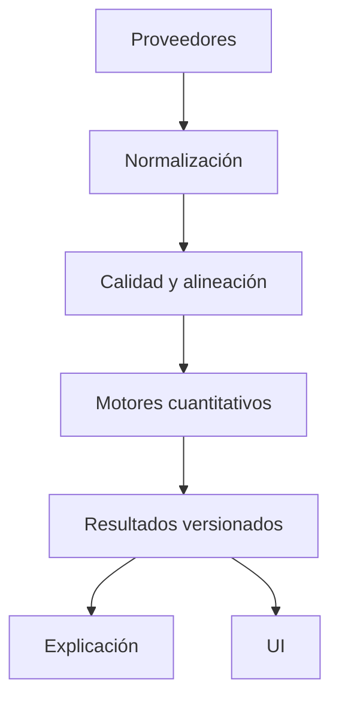
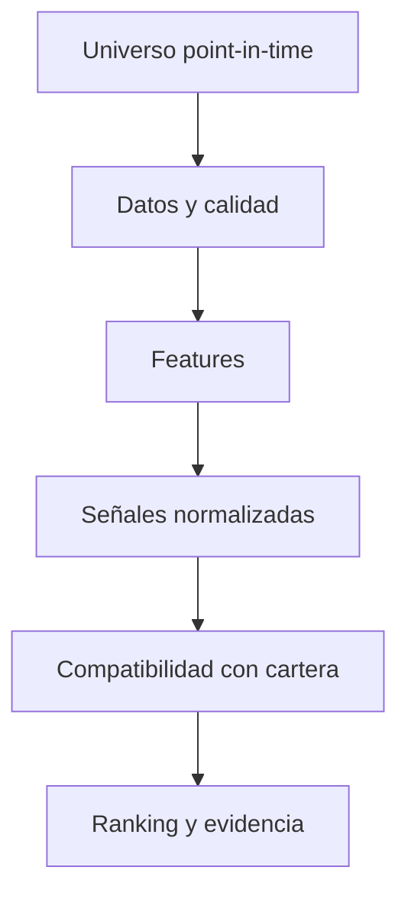

# Arquitectura cuantitativa y de datos

## 1. Propósito

Este documento especifica:

- el modelo de dominio del Laboratorio;
- las fronteras entre datos observados, cálculos y presentación;
- las entidades persistentes;
- los contratos TypeScript/Zod;
- las métricas de estabilidad;
- los escenarios;
- la generación de carteras candidatas;
- las señales de sectores y, más adelante, empresas;
- la reproducibilidad y el gobierno de modelos.

No debe implementarse como un único módulo. Las secciones se corresponden con fases separadas del backlog.

## 2. Reglas arquitectónicas

1. Los cálculos financieros son funciones puras siempre que sea posible.
2. Ninguna función cuantitativa obtiene datos por red.
3. Los adaptadores de proveedor producen contratos normalizados.
4. Toda frontera de red o persistencia valida con Zod.
5. Los importes monetarios transaccionales mantienen `decimal.js`; las matrices pueden usar `number` con tolerancias y validación finita.
6. No se redondea durante cálculos; solo al presentar.
7. Cada serie indica zona horaria, calendario, moneda, ajuste y frecuencia.
8. Cada ejecución registra versión de esquema y modelo.
9. Los datos ausentes no se rellenan con cero.
10. Una estimación no se convierte en hecho al guardarla.
11. Una explicación consume resultados estructurados; no recalcula.
12. Los modelos nuevos deben tener baseline y fixture dorado.

## 3. Capas propuestas



### 3.1 `src/lib/lab/domain`

Tipos del dominio sin dependencias de React, Supabase ni proveedores.

### 3.2 `src/lib/lab/schemas`

Schemas Zod y tipos inferidos para:

- requests;
- resultados;
- persistencia local;
- respuestas de Edge Functions;
- eventos de auditoría.

### 3.3 `src/lib/lab/data`

- normalización;
- alineación;
- cobertura;
- clasificación;
- adaptadores point-in-time;
- caché.

### 3.4 `src/lib/lab/analytics`

- estabilidad;
- dependencia;
- escenarios;
- carteras candidatas;
- señales.

### 3.5 `src/lib/lab/explanations`

- reglas deterministas;
- plantillas;
- contratos para narración opcional;
- vocabulario y advertencias.

### 3.6 `src/features/lab`

Hooks y componentes de aplicación. Solo consume servicios y view models.

## 4. Tiempo, fechas y point-in-time

Hay que distinguir:

- `observedAt`: instante al que se refiere el valor;
- `availableAt`: instante desde el que ese dato estaba disponible;
- `ingestedAt`: instante de recepción;
- `validFrom/validTo`: vigencia de clasificaciones o holdings;
- `asOf`: corte común de una ejecución;
- `calculatedAt`: ejecución del cálculo.

Ejemplo: unos fundamentales del trimestre terminado el 31 de marzo no estaban disponibles ese día. Un backtest solo puede usarlos desde `availableAt`.

Reglas:

1. Las señales utilizan `availableAt <= rebalanceAt`.
2. Los holdings de ETF muestran su fecha de vigencia.
3. Una corrección posterior crea una nueva versión, no reescribe el registro histórico si afecta a reproducibilidad.
4. Las series se normalizan a UTC, pero conservan timezone/mercado.
5. El calendario de mercado debe formar parte de la definición de alineación.

## 5. Modelo de identidad de activos

El ticker no es identificador suficiente.

### 5.1 `InstrumentId`

Campos:

- `instrumentId`: UUID interno;
- `symbol`;
- `exchangeMic`;
- `isin`, opcional;
- `providerIds`;
- `assetType`;
- `currency`;
- `countryOfRisk`;
- `status`;
- `validFrom/validTo`.

### 5.2 Alias

Tabla/entidad de aliases:

- proveedor;
- símbolo de proveedor;
- exchange;
- periodo de vigencia;
- instrumento canónico;
- confianza del mapping;
- estado de revisión.

### 5.3 Acciones corporativas

Para acciones/ETF:

- splits;
- dividendos;
- fusiones;
- cambios de ticker;
- delistings;
- spin-offs.

El motor debe conocer si la serie es:

- precio no ajustado;
- ajustado por splits;
- total return;
- ajustado por dividendos.

No mezclar tipos dentro de un mismo cálculo.

## 6. Perfil e Investment Policy Statement

### 6.1 Separación conceptual

`RiskProfile` actual no se elimina de inmediato. Se adapta y migra a:

- `RiskQuestionnaireResponse`;
- `RiskAssessment`;
- `InvestmentPolicy`;
- `InvestmentGoal`;
- `PortfolioConstraint`.

### 6.2 InvestmentPolicy

```ts
type InvestmentPolicy = {
  id: string
  userId?: string
  version: number
  status: 'draft' | 'active' | 'superseded'
  effectiveFrom: string
  reviewedAt?: string
  nextReviewAt?: string
  baseCurrency: CurrencyCode
  riskTolerance: RiskBand
  lossCapacity: RiskBand
  riskNeed: RiskBand
  effectiveRisk: RiskBand
  liquidityReserveMonths?: number
  contributionPlan?: ContributionPlan
  rebalancePolicy: RebalancePolicy
  assumptions: PolicyAssumptions
  acknowledgements: PolicyAcknowledgement[]
}
```

### 6.3 Objetivos

Cada objetivo:

- nombre;
- prioridad;
- divisa;
- importe objetivo real/nominal;
- fecha;
- aportación;
- gasto/retirada;
- flexibilidad de fecha;
- flexibilidad de importe;
- probabilidad objetivo, si el modelo la soporta;
- cuenta o cartera asociada.

### 6.4 Restricciones

Tipos:

- peso mínimo/máximo por activo;
- peso por clase;
- emisor;
- sector;
- región;
- moneda;
- cripto;
- activo bloqueado;
- lista permitida/prohibida;
- liquidez;
- turnover;
- número de posiciones;
- complejidad;
- sostenibilidad, solo con datos definidos;
- aportaciones solamente;
- no vender por condición fiscal manual.

```ts
type PortfolioConstraint =
  | { kind: 'assetWeight'; instrumentId: string; min?: number; max?: number }
  | { kind: 'groupWeight'; dimension: ExposureDimension; key: string; min?: number; max?: number }
  | { kind: 'turnover'; max: number }
  | { kind: 'liquidity'; minimumLiquidWeight: number }
  | { kind: 'lockedPosition'; instrumentId: string; weight?: number }
  | { kind: 'eligibleUniverse'; instrumentIds: string[] }
  | { kind: 'contributionsOnly'; enabled: true }
```

### 6.5 Regla de riesgo efectivo

Versión inicial:

`effectiveRisk = min(riskTolerance, lossCapacity)`

`riskNeed` no aumenta automáticamente el riesgo efectivo. Si `riskNeed > effectiveRisk`, se genera un conflicto:

- aumentar aportación;
- ampliar horizonte;
- reducir objetivo;
- aceptar explícitamente una revisión del perfil;
- buscar asesoramiento profesional.

La regla y su versión se guardan.

## 7. Snapshot de cartera

### 7.1 PortfolioSnapshot

Un snapshot es inmutable y contiene:

- `snapshotId`;
- `portfolioId`;
- `asOf`;
- moneda base;
- posiciones;
- efectivo;
- precios/FX usados;
- política de costes;
- cobertura;
- hash canónico.

### 7.2 PositionSnapshot

- instrumento;
- cantidad;
- precio;
- FX;
- valor local/base;
- peso;
- coste conocido/desconocido;
- cuenta;
- lotes opcionales;
- provenance.

### 7.3 Hash

El hash debe derivarse de una serialización canónica de:

- instrumentos;
- cantidades;
- precios/FX;
- asOf;
- política de costes;
- versión.

Sirve para deduplicar runs, no como secreto ni firma legal.

## 8. Calidad de datos

### 8.1 Dimensiones

Cada campo o dataset recibe:

- disponibilidad;
- completitud;
- frescura;
- consistencia;
- validez;
- cobertura temporal;
- confiabilidad de fuente;
- condición point-in-time.

### 8.2 Estado

```ts
type DataQualityStatus = 'good' | 'partial' | 'insufficient' | 'stale' | 'invalid'

type DataQualityIssue = {
  code: string
  severity: 'info' | 'warning' | 'blocking'
  scope: 'portfolio' | 'instrument' | 'series' | 'classification' | 'model'
  entityId?: string
  messageKey: string
  observed?: unknown
  required?: unknown
  remediation?: string
}
```

### 8.3 Cobertura ponderada

Para una métrica que usa posiciones:

$$
\mathrm{Coverage} =
\frac{\sum_{i \in \mathrm{valid}} V_i}
     {\sum_{i \in \mathrm{all}} V_i}
$$

La cobertura no sustituye otros mínimos. Un activo pequeño con historia corta puede impedir una matriz completa, aunque la cobertura en capital sea alta.

### 8.4 Matriz de mínimos iniciales

Los valores definitivos se calibran, pero el contrato debe permitir:

| Cálculo | Muestra orientativa | Cobertura | Si no cumple |
|---|---:|---:|---|
| Exposición directa | snapshot completo | 100 % del valor conocido | Bloquear si valor no cuadra |
| Look-through | holdings con vigencia | mostrar porcentaje cubierto | Resultado parcial |
| Volatilidad | 60 observaciones | ≥ 90 % del capital | Parcial/bloquear según uso |
| Correlación | 60 pares alineados | par a par | Mostrar N por celda |
| CVaR histórico | 250 observaciones preferidas | ≥ 90 % | Bloquear o advertencia fuerte |
| Señal sectorial | definido por factor | universo mínimo | Excluir sector |

Los umbrales no se esconden en componentes. Se centralizan y versionan.

## 9. Contratos de series

```ts
type ReturnSeries = {
  instrumentId: string
  currency: CurrencyCode
  frequency: 'daily' | 'weekly' | 'monthly'
  returnType: 'simple' | 'log'
  adjustment: 'price' | 'splitAdjusted' | 'totalReturn'
  timezone: string
  observations: Array<{ at: string; value: number }>
  source: DataProvenance
}
```

### 9.1 Alineación

Opciones explícitas:

- intersección estricta;
- calendario común con forward-fill de precio, no de retorno, solo cuando proceda;
- pares disponibles para matriz;
- exclusión de activos.

La elección se registra. No usar `0` como retorno de un día ausente sin conocer si el mercado estaba cerrado.

### 9.2 FX

Para retorno en moneda base:

$$
1 + r_{\mathrm{base}} = (1 + r_{\mathrm{local}})(1 + r_{\mathrm{fx}})
$$

Definir la orientación del par FX de forma única y probarla con fixtures.

## 10. Motor de estabilidad

### 10.1 Entradas

- snapshot;
- series;
- configuración;
- política;
- benchmark opcional;
- thresholds versionados.

### 10.2 Salida

```ts
type StabilityResult = {
  schemaVersion: number
  modelVersion: string
  asOf: string
  window: AnalysisWindow
  coverage: CoverageResult
  concentration: ConcentrationMetrics
  risk: RiskMetrics
  dependency: DependencyMetrics
  drawdown: DrawdownMetrics
  contributions: RiskContribution[]
  stability: EstimateStability
  breaches: PolicyBreach[]
  warnings: ModelWarning[]
}
```

### 10.3 Concentración

Con pesos $w_i$:

$$
\mathrm{HHI} = \sum_i w_i^2
$$

$$
N_{\mathrm{eff}} = \frac{1}{\mathrm{HHI}}
$$

Calcular por:

- posición;
- emisor;
- sector;
- región;
- divisa;
- cluster;
- factor, si la representación lo permite.

Los pesos cortos, si se soportan después, requieren definición separada. En MVP se asume long-only.

### 10.4 Volatilidad

$$
\sigma_p = \sqrt{w^\top \Sigma w}
$$

Anualización:

$$
\sigma_{\mathrm{ann}} = \sigma_{\mathrm{period}} \sqrt{K}
$$

$K$ depende de la frecuencia y se guarda.

Covarianzas:

- muestra, para transparencia/baseline;
- shrinkage Ledoit-Wolf, predeterminada cuando esté validada;
- EWMA opcional, con lambda explícito.

### 10.5 Contribución al riesgo

Marginal:

$$
\mathrm{MRC}_i = \frac{(\Sigma w)_i}{\sigma_p}
$$

Absoluta:

$$
\mathrm{RC}_i = w_i \mathrm{MRC}_i
$$

Porcentual:

$$
\mathrm{PCR}_i = \frac{\mathrm{RC}_i}{\sigma_p}
$$

Comprobar Euler:

$$
\sum_i \mathrm{RC}_i \approx \sigma_p
$$

### 10.6 Downside

Incluir:

- downside deviation con MAR definido;
- semivarianza;
- drawdown;
- máximo drawdown;
- duración;
- tiempo de recuperación histórico;
- VaR/CVaR histórico.

CVaR histórico al nivel $\alpha$:

$$
\mathrm{CVaR}_\alpha = -\mathbb{E}\left[r_p \mid r_p \le q_{1-\alpha}\right]
$$

Definir signos en API y UI. Recomendación: pérdidas positivas en tarjetas, retornos negativos en series.

### 10.7 Diversificación

$$
\mathrm{DR} = \frac{\sum_i w_i \sigma_i}{\sigma_p}
$$

También:

- correlación media ponderada;
- número efectivo de apuestas basado en contribuciones;
- reducción de volatilidad frente a suma ponderada.

### 10.8 Estabilidad de estimación

Ejecutar perturbaciones controladas:

- ventanas;
- frecuencia;
- método de covarianza;
- bootstrap por bloques;
- exclusión de datos parciales.

Salida:

- rango de cada métrica;
- cambio de ranking;
- estabilidad de principal riesgo;
- etiqueta estable/sensible/no concluyente.

## 11. Motor de dependencia

### 11.1 Matrices

- correlación Pearson;
- Spearman opcional;
- covarianza;
- correlación downside;
- correlación rolling.

Cada celda:

- estimación;
- número de pares;
- fecha inicial/final;
- warning si la muestra es baja.

### 11.2 Downside correlation

La condición debe ser explícita:

- cartera/benchmark por debajo de 0;
- percentil inferior;
- ambos activos negativos;
- régimen etiquetado.

No mezclar definiciones entre ejecuciones.

### 11.3 Clustering

Primera versión:

- distancia $d_{ij}=\sqrt{0.5(1-\rho_{ij})}$;
- clustering jerárquico;
- linkage versionado;
- umbral o número de clusters configurable;
- estabilidad por resampling.

El clustering ordena y explica, no demuestra causalidad.

### 11.4 Factores

Fase posterior o limitada:

- mercado;
- tamaño;
- valor;
- calidad;
- momentum;
- duración/tipos;
- crédito;
- dólar/FX;
- cripto beta.

Requiere series de factores con licencia y calendario coherente. La regresión muestra:

- beta;
- error estándar;
- $R^2$;
- ventana;
- multicolinealidad;
- residuo;
- estabilidad.

No etiquetar exposición económica solo a partir de una beta inestable.

## 12. Look-through y solapamiento

### 12.1 Datos

`FundHoldingObservation`:

- fondo;
- componente;
- peso;
- `validFrom`;
- `reportedAt`;
- fuente;
- cobertura del fondo;
- nivel de look-through.

### 12.2 Cálculo

Exposición real:

$$
\mathrm{Exposure}_j = \sum_f w_f h_{f,j} + w_j^{\mathrm{direct}}
$$

### 12.3 Reglas

- normalizar solo dentro de la cobertura conocida si se muestra claramente; preferible conservar «otros/no cubierto»;
- evitar expandir recursivamente sin límite;
- detectar ciclos;
- no sumar derivados sin metodología específica;
- mostrar efectivo y otros;
- separar país de domicilio y país de riesgo.

### 12.4 Solapamiento

Métricas:

- min-overlap: $\sum_j \min(h_{a,j}, h_{b,j})$;
- exposición duplicada de cartera;
- top contribuyentes al solapamiento.

## 13. Motor de escenarios

### 13.1 Tipos

1. **Histórico reproducido**: aplicar retornos observados de un periodo.
2. **Determinista**: shocks introducidos.
3. **Factorial**: shocks de factores traducidos a activos.
4. **Monte Carlo**: trayectorias bajo distribución/modelo declarado.
5. **Objetivo-aportación**: evolución con flujos y rebalanceos.

### 13.2 Contrato

```ts
type ScenarioDefinition = {
  id: string
  version: number
  kind: 'historical' | 'deterministic' | 'factor' | 'monteCarlo' | 'goal'
  name: string
  horizon: ScenarioHorizon
  assumptions: ScenarioAssumption[]
  contributionPlan?: ContributionPlan
  rebalancePolicy?: RebalancePolicy
  costs?: CostModel
  seed?: string
}
```

```ts
type ScenarioResult = {
  runId: string
  definition: ScenarioDefinition
  portfolioSnapshotId: string
  modelVersion: string
  outputs: {
    terminalValue?: DistributionSummary
    return?: DistributionSummary
    drawdown?: DistributionSummary
    losses?: PositionLoss[]
    goalAttainment?: SimulationFrequency
    breaches: PolicyBreach[]
  }
  sensitivity: SensitivityResult[]
  warnings: ModelWarning[]
}
```

### 13.3 Determinista

Para shocks por activo:

$$
\Delta V = \sum_i V_i s_i
$$

Para shocks factoriales:

$$
r_i = \alpha_i + \sum_k \beta_{ik} f_k + \epsilon_i
$$

Definir tratamiento del residuo.

### 13.4 Monte Carlo

Fases:

- MVP: bootstrap por bloques de retornos históricos;
- opcional: modelo paramétrico con colas;
- opcional: regímenes validados.

Debe registrar:

- semilla;
- número de trayectorias;
- tamaño de bloque;
- ventanas;
- rebalanceo;
- costes;
- inflación;
- tratamiento de aportaciones.

No llamar probabilidad objetiva al porcentaje de trayectorias si el modelo no está calibrado.

### 13.5 Sensibilidad

Variar:

- retorno esperado;
- volatilidad;
- correlación;
- inflación;
- aportación;
- costes;
- horizonte.

Mostrar qué supuesto domina el resultado.

## 14. Carteras candidatas

### 14.1 Filosofía

No existe «la mejor cartera» fuera de una función objetivo, restricciones, datos y fecha. El motor devuelve un conjunto de candidatas y el frente de compromisos.

### 14.2 Baselines obligatorios

- actual;
- mantener pesos;
- aportaciones para volver a bandas;
- 1/N;
- límites simples por clase.

Un modelo sofisticado no se publica si su mejora desaparece frente a estos baselines tras costes y fuera de muestra.

### 14.3 Problema general

$$
\min_w f(w; \mu, \Sigma)
$$

sujeto a:

$$
\sum_i w_i = 1,\qquad l_i \le w_i \le u_i
$$

y restricciones de grupos, turnover y liquidez.

### 14.4 Métodos

#### A. Aportaciones solamente

Minimizar distancia a pesos objetivo usando efectivo nuevo, sin ventas.

#### B. Mínima varianza

$$
\min_w w^\top \Sigma w
$$

Usar covarianza regularizada y límites.

#### C. Equal Risk Contribution

$$
\mathrm{RC}_i \approx \mathrm{RC}_j
$$

para activos elegibles, con restricciones.

#### D. CVaR

Optimización sobre escenarios si el motor especializado está disponible.

#### E. Black-Litterman

Solo tras:

- prior de equilibrio documentado;
- views derivadas de señales versionadas;
- matriz de confianza;
- sensibilidad a tau/omega;
- comparación con prior sin views.

No permitir que un LLM genere $\mu$ ni confianza.

#### F. HRP

Puede ofrecerse como candidata exploratoria. Debe compararse fuera de muestra y no asumirse superior.

### 14.5 Restricciones duras y blandas

- Duras: nunca pueden violarse.
- Blandas: penalización visible.

Ejemplos de blandas:

- minimizar turnover;
- cercanía a cartera actual;
- concentración;
- desviación sectorial.

La API devuelve violaciones y slack.

### 14.6 Costes

$$
\mathrm{Cost} = \sum_i c_i |\Delta w_i| + \mathrm{fixed}_i + \mathrm{impact}_i
$$

MVP:

- porcentaje/bps por clase;
- comisión fija opcional;
- FX;
- flag de coste desconocido.

No modelar impacto de mercado sin datos.

### 14.7 Robustez

Para cada candidata:

- bootstrap/perturbación de $\mu$ y $\Sigma$;
- distribución de pesos;
- turnover;
- frecuencia de selección;
- rango de riesgo;
- pérdida de optimalidad;
- soluciones de esquina.

Si una solución cambia drásticamente por una perturbación pequeña, la UI la marca sensible.

### 14.8 Restricciones de implementación

MVP TypeScript:

- long-only;
- universo pequeño;
- métodos con solver validado o algoritmos propios bien probados;
- timeout y determinismo.

Servicio Python opcional:

- CVXPY u otra biblioteca madura;
- contenedor versionado;
- payload limitado;
- resultados validados por schema;
- no almacenar tokens del usuario;
- idempotencia;
- resource limits.

La elección se resuelve en ADR-006.

## 15. Motor de brechas y reparaciones

### 15.1 Entrada

- IPS;
- snapshot;
- estabilidad;
- exposición;
- datos;
- carteras candidatas opcionales.

### 15.2 Reglas

Reglas declarativas versionadas:

```ts
type DiagnosticRule = {
  id: string
  version: string
  severity: 'info' | 'warning' | 'critical'
  requiredInputs: string[]
  evaluate: RuleExpression
  evidenceTemplate: string
  remediationOptions: RemediationKind[]
}
```

### 15.3 Priorización

Orden base:

1. integridad de datos;
2. restricciones duras;
3. capacidad de pérdida/liquidez;
4. concentración;
5. dependencia;
6. riesgo;
7. coste;
8. señal táctica.

La materialidad combina:

- tamaño de brecha;
- peso afectado;
- contribución a riesgo;
- severidad IPS;
- confianza del dato.

No debe ser una caja negra.

## 16. Señales sectoriales

## 16.1 Objetivo

Ordenar sectores que merecen investigación bajo un universo, horizonte y fecha. No producir una previsión puntual ni una orden.

## 16.2 Pipeline



### 16.3 Universo

Debe definir:

- taxonomía sectorial;
- región;
- vehículos representativos;
- moneda;
- mínimo de historia;
- liquidez;
- estado activo/inactivo;
- componentes a cada fecha.

No usar el universo actual para el pasado.

### 16.4 Familias de señal candidatas

Cada una requiere hipótesis, fórmula, frecuencia y validación:

- momentum de precio;
- reversión a largo plazo;
- valoración relativa;
- calidad/profitability;
- revisiones o crecimiento;
- volatilidad/downside;
- tendencia macro;
- sensibilidad a tipos/inflación;
- diversificación marginal frente a la cartera;
- crowding/concentración;
- calidad de datos.

No todas deben entrar. El MVP puede empezar con dos o tres señales robustas y una puntuación de diversificación.

### 16.5 Normalización

Opciones:

- z-score winsorizado;
- ranking percentil;
- neutralización por región;
- robust scaling.

Guardar:

- población;
- parámetros;
- outlier policy;
- missing policy.

### 16.6 Combinación

Baseline:

$$
\mathrm{Score}_s = \sum_k a_k z_{s,k}
$$

con pesos fijos, suma uno y versionados.

Alternativas posteriores:

- combinación por desempeño histórico;
- shrinkage de pesos;
- modelos supervisados con gobierno reforzado.

Evitar optimizar pesos de señal y evaluar en la misma muestra.

### 16.7 Compatibilidad con cartera

Una puntuación de mercado no basta. Ajustes/filtros:

- exposición actual;
- correlación;
- contribución marginal;
- restricción sectorial;
- moneda;
- liquidez;
- conflicto con IPS;
- coste de vehículo.

Separar:

- `marketScore`;
- `portfolioFitScore`;
- `dataQualityScore`;
- `finalResearchScore`.

No ocultar cada componente.

### 16.8 Resultado

```ts
type SectorResearchCandidate = {
  sectorId: string
  asOf: string
  horizon: string
  universeVersion: string
  modelVersion: string
  marketScore: number
  portfolioFitScore: number
  dataQualityScore: number
  finalResearchScore: number
  rank?: number
  evidence: EvidenceItem[]
  reasonsFor: ReasonCode[]
  reasonsAgainst: ReasonCode[]
  exclusions: ExclusionReason[]
  expiresAt: string
}
```

### 16.9 Caducidad

Una señal incluye `expiresAt`. Al caducar:

- no desaparece;
- se marca obsoleta;
- no se usa para una nueva candidata;
- ofrece recalcular.

### 16.10 Backtest

Obligatorio:

- walk-forward;
- costes;
- rebalanceo realista;
- universos point-in-time;
- acciones corporativas;
- múltiples regiones/regímenes;
- benchmark;
- 1/N sectorial;
- intervalos por bootstrap;
- análisis de turnover;
- periodo final no tocado.

Métricas:

- retorno y volatilidad;
- drawdown;
- Sharpe/Sortino con advertencias;
- hit rate sin sobreinterpretación;
- information coefficient;
- turnover;
- estabilidad de ranking;
- capacidad aproximada si procede;
- resultados por régimen.

## 17. Empresas para investigar

## 17.1 Puerta previa

No se implementa en producción hasta que:

- G7 esté superada;
- exista proveedor point-in-time de fundamentales;
- se resuelvan delistings y acciones corporativas;
- haya universo histórico;
- los datos y su licencia permitan el uso;
- exista revisión de lenguaje/compliance;
- la watchlist tenga caducidad y razones de exclusión.

## 17.2 Pipeline

1. Sector/universo permitido.
2. Liquidez y tamaño.
3. Datos suficientes.
4. Calidad/valoración/momentum seleccionados.
5. Riesgo idiosincrático.
6. exposición marginal a la cartera.
7. redundancia con fondos.
8. exclusiones.
9. ranking de investigación.

## 17.3 Prohibiciones

- objetivos de precio generados sin modelo validado;
- resumen de noticias sin fuente;
- fundamentales actuales usados en backtest pasado;
- empresas desaparecidas excluidas del universo histórico;
- ranking personalizado sin mostrar restricciones;
- LLM como filtro decisorio.

## 18. Explicaciones

### 18.1 Primera versión: determinista

Las explicaciones se generan con:

- códigos de razón;
- plantillas traducibles;
- valores estructurados;
- reglas de prioridad.

Ejemplo:

```json
{
  "reasonCode": "CONCENTRATION_CRYPTO_RISK",
  "facts": {
    "capitalWeight": 0.5,
    "riskContribution": 0.71,
    "policyMax": 0.15
  },
  "asOf": "2026-08-08",
  "confidence": "high"
}
```

### 18.2 LLM opcional

Puede:

- reformular;
- ordenar explicaciones;
- responder preguntas educativas a partir de evidencia.

No puede:

- crear métricas;
- cambiar una puntuación;
- elegir pesos;
- suplir datos;
- afirmar causalidad no presente;
- ocultar advertencias;
- generar orden de compra/venta.

El prompt recibe una allowlist de campos, no la base completa. La salida se valida, se filtra y se etiqueta como explicación generada.

## 19. Persistencia propuesta en PostgreSQL

Todas las tablas privadas incluyen `user_id`, RLS y timestamps. Las globales separan acceso público de escritura de servicio.

## 19.1 Tablas privadas

### `investment_policies`

- id;
- user_id;
- version;
- status;
- effective_from;
- reviewed_at;
- next_review_at;
- base_currency;
- risk bands;
- configuration JSONB validado;
- created_at.

Unique: usuario + versión. Solo una active mediante índice parcial.

### `investment_goals`

- id;
- policy_id;
- user_id redundante para RLS;
- priority;
- target;
- currency;
- target_date;
- flexibility;
- contribution plan.

### `portfolio_constraints`

- id;
- policy_id;
- user_id;
- kind;
- target dimension/key;
- min/max;
- hard;
- configuration.

### `portfolio_snapshots`

- id;
- user_id;
- as_of;
- base_currency;
- canonical_hash;
- source;
- quality;
- created_at.

### `portfolio_snapshot_positions`

- snapshot_id;
- user_id;
- instrument_id;
- quantity/value/weight;
- price/FX references;
- account reference;
- provenance.

### `analytics_runs`

- id;
- user_id;
- run_type;
- status;
- snapshot_id;
- policy_id;
- schema_version;
- model_version_id;
- input_hash;
- requested_at;
- started_at;
- completed_at;
- expires_at;
- warnings;
- failure_code.

### `analytics_run_results`

- run_id;
- user_id;
- result_type;
- result JSONB;
- result_hash;
- created_at.

Separar resultados grandes en objeto/blob solo si es necesario y con autorización.

### `scenario_definitions`

- id;
- user_id;
- version;
- name;
- kind;
- definition;
- archived_at.

### `scenario_runs`

Puede ser una vista o referencia especializada a `analytics_runs`.

### `lab_saved_comparisons`

- id;
- user_id;
- run_ids;
- label;
- annotations;
- created_at.

### `research_watchlists`

- id;
- user_id;
- universe;
- entries;
- based_on_run_id;
- expires_at.

### `lab_audit_events`

- id;
- user_id;
- actor type;
- action;
- entity type/id;
- model/data versions;
- metadata redacted;
- created_at.

## 19.2 Tablas globales o de catálogo

### `instruments`

Identidad canónica. Lectura controlada; escritura de servicio.

### `instrument_aliases`

Mappings por proveedor y vigencia.

### `asset_classifications`

- instrumento;
- taxonomía;
- dimensión;
- valor;
- valid_from/to;
- fuente;
- confidence.

### `fund_holding_observations`

Holdings point-in-time con licencia. No se crea si el proveedor prohíbe persistir.

### `market_observations`

Puede ampliar caches actuales o quedar en proveedor externo. Definir retención y licencia.

### `model_versions`

- id;
- model key;
- semantic version;
- code commit SHA;
- schema version;
- parameters;
- training window, si aplica;
- validation report;
- status draft/validated/active/retired;
- activated_at;
- owner.

### `sector_signal_observations`

- as_of;
- sector;
- universe/model;
- scores;
- coverage;
- evidence references;
- expires_at.

No mezclar signals globales con ajuste personal. La compatibilidad de cartera se calcula en un run privado.

## 19.3 RLS

Patrón:

- el usuario solo puede seleccionar/modificar filas con `auth.uid() = user_id`;
- las posiciones requieren además que el snapshot pertenezca al usuario;
- tablas globales: select según política; insert/update solo service role;
- funciones `security definer` mínimas, con `search_path` fijado y permisos explícitos;
- ningún ID suministrado por cliente basta para autorización.

## 20. Migración desde el dominio actual

### 20.1 `RiskProfile`

1. Mantener lectura.
2. Crear adaptador que traduzca category/score a borrador de assessment.
3. Solicitar campos faltantes.
4. Crear IPS v1 solo tras confirmación.
5. No inventar capacidad o horizonte.

### 20.2 `RiskResult`

1. Mantener tabla/estructura para resultados actuales.
2. Nuevos runs usan `analytics_runs`.
3. Adaptador de lectura muestra resultados legacy con etiqueta.
4. No convertir JSON antiguo sin conocer su modelo.

### 20.3 Store local

Slices propuestos:

- portfolio;
- market;
- settings;
- auth/sync;
- labProfile;
- labWorkspace;
- labRunsIndex.

Series grandes y resultados pesados en IndexedDB con clave versionada.

## 21. API de Edge Functions

### 21.1 Convenciones

- JSON;
- auth JWT;
- `requestId`;
- idempotency key para runs;
- `schemaVersion`;
- errores tipados;
- límites de tamaño;
- rate limiting;
- CORS de orígenes esperados;
- no devolver stack traces.

### 21.2 Endpoints lógicos

Pueden agruparse en menos funciones físicas:

- `lab-create-snapshot`;
- `lab-run-stability`;
- `lab-run-scenario`;
- `lab-generate-candidates`;
- `lab-sector-research`;
- `lab-run-status`;
- `lab-run-result`;
- `lab-refresh-market-data`.

### 21.3 Estado de run

`queued → running → completed | partial | failed | cancelled`

Un run completado no cambia. Una actualización crea otro.

### 21.4 Idempotencia

Clave derivada de:

- usuario;
- tipo;
- input hash;
- model version;
- ventana temporal.

Repetir la misma petición devuelve el run existente dentro de la ventana configurada.

## 22. Catálogo de errores

Ejemplos:

- `LAB_INVALID_INPUT`;
- `LAB_INSUFFICIENT_HISTORY`;
- `LAB_PARTIAL_COVERAGE`;
- `LAB_STALE_DATA`;
- `LAB_PROVIDER_RATE_LIMIT`;
- `LAB_PROVIDER_UNAVAILABLE`;
- `LAB_UNIVERSE_NOT_SUPPORTED`;
- `LAB_CONSTRAINTS_INFEASIBLE`;
- `LAB_MODEL_NOT_ACTIVE`;
- `LAB_RUN_TIMEOUT`;
- `LAB_UNAUTHORIZED`;
- `LAB_RESULT_EXPIRED`.

Cada error tiene:

- HTTP status;
- código estable;
- mensaje traducible;
- recuperable sí/no;
- acción;
- detalles no sensibles.

## 23. Rendimiento y límites

Definir antes de implementar:

- máximo de activos para cálculo local;
- tamaño máximo de serie;
- máximo de escenarios;
- timeout;
- memoria;
- tamaño de payload;
- TTL por dato;
- concurrencia por usuario;
- jobs diarios de señales.

Propuesta inicial:

- hasta 50 posiciones para análisis local completo;
- hasta 10 años diarios por activo con almacenamiento en IndexedDB;
- matrices grandes calculadas en Web Worker;
- cálculos >2 s fuera del hilo principal;
- backtests y rankings globales fuera del navegador.

Estos valores son presupuestos de ingeniería, no hechos; deben medirse.

## 24. Pruebas cuantitativas mínimas

Cada fórmula debe tener:

- caso manual pequeño;
- caso de identidad;
- caso límite;
- propiedad;
- comparación con implementación independiente;
- tolerancia absoluta/relativa;
- fixture versionado.

Ejemplos:

- correlación de una serie consigo misma = 1;
- matriz de covarianza simétrica;
- varianza no negativa dentro de tolerancia;
- contribuciones suman volatilidad;
- HHI entre (1/n) y 1 para pesos long-only;
- pesos suman uno;
- restricciones se cumplen;
- misma semilla produce mismo escenario;
- orden de inputs no cambia el resultado canónico;
- FX con retorno cero conserva retorno local.

El documento 05 amplía esta estrategia.

## 25. Decisiones pendientes antes de cada fase

| Fase | Decisión |
|---|---|
| 2 | Escala exacta de bandas de riesgo y validez temporal de IPS |
| 3 | Frecuencia predeterminada y estimador de covarianza |
| 4 | Fuente/licencia de clasificación y holdings |
| 5 | Bootstrap frente a modelo paramétrico en MVP |
| 6 | Solver y frontera TypeScript/servicio |
| 7 | Taxonomía sectorial, universo, señales y frecuencia |
| 8 | Proveedor fundamental, delistings y jurisdicción |

Ninguna decisión debe enterrarse en una constante sin ADR.

## 26. Criterios de aceptación de arquitectura cuantitativa

1. Una ejecución se reproduce con snapshot, configuración y modelo.
2. La UI no obtiene datos directamente de una fórmula o proveedor.
3. Los resultados parciales indican exactamente qué parte cubren.
4. Las matrices tienen muestra por par.
5. Los pesos cumplen restricciones dentro de tolerancia.
6. Un escenario tiene definición, semilla cuando procede y etiqueta.
7. Una señal global y su ajuste a cartera están separados.
8. Ningún LLM interviene en números o selección.
9. Los backtests usan `availableAt`, no solo `observedAt`.
10. Las tablas privadas pasan pruebas de acceso cruzado.
11. Las migraciones antiguas no se reescriben.
12. La aplicación puede explicar por qué una candidata fue excluida.
