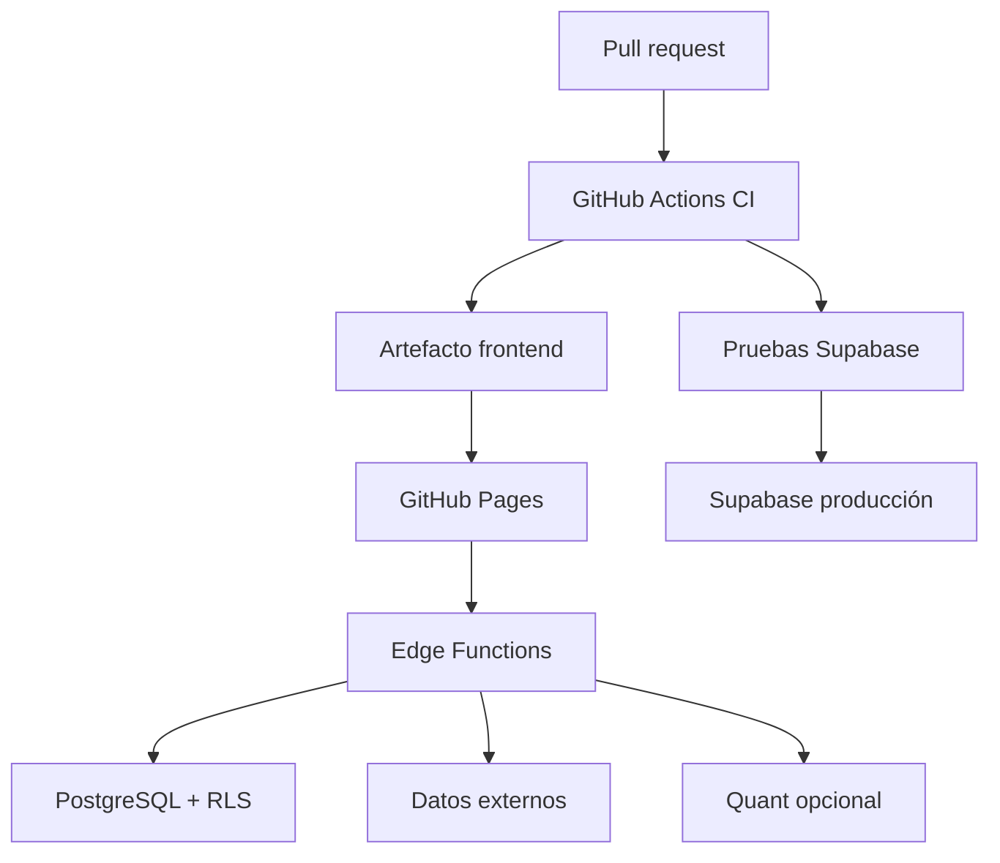

# Arquitectura del sistema, infraestructura y CI/CD

## 1. Objetivo

Este documento define cómo ejecutar, proteger, probar y desplegar el Laboratorio manteniendo GitHub Pages como hosting del frontend.

La arquitectura debe reconocer una limitación central:

> GitHub Pages sirve archivos estáticos. No ejecuta backend, no almacena secretos y no es el lugar para jobs cuantitativos, proxies de mercado ni procesos programados.

Por tanto:

- navegador: presentación y cálculos locales acotados;
- Supabase: identidad, datos, RLS, Edge Functions y orquestación;
- proveedor externo: datos;
- servicio cuantitativo opcional: cálculo pesado;
- GitHub Actions: calidad, build y despliegues.

## 2. Estado actual auditado

### 2.1 Frontend

- React 19;
- TypeScript;
- Vite 6;
- HashRouter;
- base `/RiskCalculator/` cuando `DEPLOY_TARGET=gh-pages`;
- GitHub Pages.

### 2.2 Workflow actual

`.github/workflows/deploy-pages.yml`:

- push a `main` y ejecución manual;
- checkout;
- Node 22;
- `npm ci`;
- `npm run build`;
- upload Pages artifact;
- deploy.

Variables:

- `DEPLOY_TARGET=gh-pages`;
- `VITE_SUPABASE_URL`;
- `VITE_SUPABASE_ANON_KEY`.

La anon key es pública por diseño, pero nunca debe confundirse con service role.

### 2.3 Brecha

El workflow de despliegue no obliga actualmente a superar:

- lint;
- typecheck explícito;
- unit tests;
- cobertura;
- E2E;
- pruebas de migraciones/RLS;
- pruebas de Edge Functions;
- escaneo de seguridad.

`npm run build` incluye `tsc -b`, pero debe conservarse un job de tipos separado para diagnóstico y para no depender de una implementación implícita del script.

## 3. Topología objetivo



## 4. Entornos

### 4.1 Local

- Vite;
- Supabase CLI local;
- seed sintético y fixtures;
- proveedores demo/manual;
- emulaciones de Edge Functions;
- ningún secreto real necesario para pruebas normales.

### 4.2 Preview/branch

Opciones:

1. Supabase Branching para PR si está disponible en el proyecto.
2. Un proyecto de staging compartido con namespace de datos.
3. Solo Supabase local en CI para primeras fases.

La opción 3 es suficiente para F0–F3. Antes de señales programadas se necesita staging real.

### 4.3 Producción

- GitHub Pages para frontend;
- proyecto Supabase de producción;
- Edge Functions versionadas;
- secretos en Supabase/Vault;
- jobs programados;
- servicio cuantitativo independiente solo si ADR-006 lo aprueba.

### 4.4 Matriz de configuración

| Configuración | Local | CI | Staging | Producción |
|---|---|---|---|---|
| Base Vite | `/` | `/RiskCalculator/` en build Pages | según preview | `/RiskCalculator/` |
| Supabase URL | local | local/secret staging | secret | secret |
| Anon key | local | local/staging | secret público | secret público |
| Service role | no frontend | solo job aislado si imprescindible | secret protegido | secret protegido |
| Datos demo | sí | sí | sí | sí |
| Proveedores live | opcional | mock/contract test | sí limitado | sí |
| Feature flags | local | test | pre-release | aprobadas |

## 5. División de código

Estructura objetivo orientativa:

```text
src/
  features/
    lab/
      components/
      hooks/
      pages/
      routes/
      view-models/
  lib/
    lab/
      analytics/
      data/
      domain/
      explanations/
      schemas/
      services/
  state/
    slices/
supabase/
  functions/
    _shared/
    lab-api/
    lab-jobs/
    market-proxy/
  migrations/
  tests/
docs/
  adr/
  models/
  runbooks/
.github/
  workflows/
```

No mover todos los archivos de una vez. Crear la estructura al introducir cada responsabilidad.

## 6. Responsabilidades de ejecución

## 6.1 Navegador

Permitido:

- concentración;
- matrices pequeñas;
- volatilidad y contribuciones;
- estrés determinista;
- simulación acotada;
- visualización;
- persistencia local.

No permitido:

- claves de proveedor;
- service role;
- ranking global programado;
- backtests masivos;
- datos privados de otro usuario;
- llamadas directas a un servicio cuantitativo privilegiado.

### Web Workers

Usar Web Worker cuando:

- cálculo bloquea el hilo >100 ms de forma repetida;
- matrices o simulaciones son perceptibles;
- se necesita cancelación.

Contrato:

- request ID;
- payload validado;
- progreso opcional;
- cancelación;
- resultado/error tipado;
- versión.

## 6.2 Edge Functions

Funciones:

- validar JWT;
- validar input;
- comprobar pertenencia de snapshot/policy;
- rate limit;
- resolver providers;
- usar caché;
- crear/actualizar estado de run;
- llamar al motor o servicio;
- persistir resultado;
- devolver errores tipados.

Las funciones deben ser finas. Cálculos compartidos TypeScript pueden residir en `supabase/functions/_shared` o paquete común, cuidando compatibilidad Deno/navegador.

### Diseño físico recomendado

Evitar una función por endpoint si duplica arranque/configuración. Dos fronteras iniciales:

- `lab-api`: solicitudes interactivas autenticadas;
- `lab-jobs`: ejecuciones de servicio/programadas.

Rutas internas por `pathname`, con schemas separados.

## 6.3 PostgreSQL

Adecuado para:

- persistencia relacional;
- RLS;
- snapshots y metadatos;
- reglas pequeñas cerca del dato;
- colas simples;
- cron;
- vistas y agregados;
- auditoría.

No usar PL/pgSQL para:

- optimización de carteras compleja;
- backtests largos;
- ingestión masiva sin diseño específico;
- narración.

Las funciones de base de datos se reservan para integridad y operaciones intensivas en datos simples. Ver [Supabase Database Functions](https://supabase.com/docs/guides/database/functions).

## 6.4 Servicio cuantitativo opcional

### Condiciones de introducción

- el motor TS no cumple precisión/rendimiento;
- el universo supera los límites medidos;
- se necesita solver/librería no viable en Deno;
- existe presupuesto de operación;
- hay owner y runbook.

### Contrato

- API interna versionada;
- autenticación service-to-service;
- payload sin PII innecesaria;
- snapshot numérico, no credenciales;
- idempotency key;
- timeout;
- límites de CPU/memoria;
- firma o comprobación de respuesta;
- logs con run ID;
- health/readiness.

### Seguridad

- no accesible directamente desde navegador;
- allowlist de caller;
- secretos rotables;
- red privada si la plataforma lo permite;
- imagen fijada por digest;
- dependencias bloqueadas;
- SBOM;
- escaneo de imagen.

## 7. Procesos programados

Supabase documenta la invocación programada de Edge Functions con `pg_cron` y `pg_net`, guardando secretos en Vault: [Scheduling Edge Functions](https://supabase.com/docs/guides/functions/schedule-functions).

### 7.1 Jobs propuestos

| Job | Frecuencia inicial | Responsabilidad |
|---|---|---|
| `market-data-health` | cada hora/día según fuente | freshness, errores y cuotas |
| `refresh-instrument-catalog` | diaria/semanal | aliases y clasificaciones |
| `refresh-fund-holdings` | según publicación/licencia | holdings con vigencia |
| `calculate-sector-features` | diaria/semanal | features point-in-time |
| `publish-sector-signals` | tras validación | activar nueva señal global |
| `expire-stale-results` | diaria | marcar resultados caducados |
| `model-drift-check` | semanal/mensual | cobertura, distribución y estabilidad |
| `retention-cleanup` | semanal | datos según política |

### 7.2 Reglas

- cada job es idempotente;
- usa advisory lock o clave única;
- registra inicio, fin, versión y recuentos;
- reintenta con backoff limitado;
- no solapa ejecuciones;
- no activa un modelo si falla validación;
- distingue cálculo de publicación;
- alerta tras umbral;
- permite replay por rango.

### 7.3 Tabla de job runs

`scheduled_job_runs`:

- job key;
- scheduled_for;
- status;
- attempt;
- input version;
- model version;
- started/completed;
- counts;
- error code;
- correlation ID.

## 8. Caché y datos externos

### 8.1 Política

Cada tipo define:

- TTL;
- stale-while-revalidate;
- retención;
- fuente;
- licencia;
- cuota;
- fallback;
- unidad/moneda;
- tratamiento de correcciones.

### 8.2 Niveles

1. memoria del navegador;
2. IndexedDB;
3. cache global de Supabase;
4. proveedor.

### 8.3 Cache key

Incluye:

- provider;
- instrument canonical ID;
- dataset;
- frequency;
- adjustment;
- currency;
- from/to;
- provider schema version.

### 8.4 Degradación

- proveedor primario falla → proveedor compatible si contrato/semántica coinciden;
- si no → último valor con stale;
- si el resultado no es válido stale → bloquear;
- nunca mezclar series sin marcar cambio de fuente;
- nunca sustituir fundamentales por cero.

## 9. Workflows de GitHub Actions

## 9.1 `ci.yml`

### Trigger

- `pull_request`;
- `push` a `main`;
- `workflow_dispatch`.

### Permisos

```yaml
permissions:
  contents: read
```

### Concurrency

- grupo por workflow + ref;
- cancelar ejecuciones anteriores en PR;
- no cancelar un despliegue de producción ya iniciado.

### Jobs

#### A. changes

Opcional: detecta frontend, supabase, docs. No debe omitir pruebas básicas por error.

#### B. quality

Pasos:

1. checkout fijado a SHA;
2. setup-node fijado a SHA;
3. Node 22;
4. cache npm;
5. `npm ci`;
6. `npm run lint`;
7. `npm run typecheck`;
8. `npm test -- --run --coverage`;
9. subir reporte de cobertura;
10. `npm run build` con variables dummy válidas.

#### C. e2e

Pasos:

1. instalar dependencias;
2. cache Playwright compatible;
3. instalar Chromium;
4. build;
5. servir preview;
6. `npm run test:e2e`;
7. subir traces/screenshots solo en fallo.

Matrices de E2E:

- desktop Chromium;
- móvil Chromium;
- modo sin Supabase;
- modo demo.

Safari/Firefox pueden ejecutarse nightly o antes de release.

#### D. bundle

- medir tamaño de chunks;
- fallar si se supera presupuesto aprobado;
- comprobar sourcemaps según política;
- detectar import accidental de módulos de servidor.

### Branch protection

Checks requeridos:

- quality;
- e2e-core;
- supabase-tests cuando cambie backend;
- dependency-review cuando aplique.

## 9.2 `supabase-ci.yml`

Basado en la guía oficial [Testing with GitHub Actions](https://supabase.com/docs/guides/deployment/ci/testing).

### Trigger

- PR con cambios en `supabase/**`;
- push main;
- manual.

### Jobs

#### A. migration-lint

- iniciar Supabase local;
- aplicar todas las migraciones desde cero;
- verificar diff limpio;
- lint SQL;
- comprobar orden/nombres;
- impedir cambios en migraciones ya registradas mediante script/checksum.

#### B. database-tests

- pgTAP para constraints y funciones;
- pruebas RLS:
  - usuario A no lee B;
  - usuario A no modifica B;
  - no autenticado no accede;
  - global read permitido solo donde toca;
  - service role limitado al job.

#### C. edge-function-tests

- unit tests de schemas y handlers;
- mocks de proveedores;
- JWT válido/inválido;
- rate limit;
- idempotencia;
- timeout;
- errores redacted.

#### D. generated-types

- generar tipos de DB;
- comparar con tipos versionados;
- fallar si hay drift no comprometido.

## 9.3 `deploy-pages.yml`

### Trigger

- `workflow_run` de CI en `main` exitoso, o workflow reusable llamado tras CI;
- manual con environment protegido.

Evitar desplegar directamente cada push antes de las puertas.

### Permisos

```yaml
permissions:
  contents: read
  pages: write
  id-token: write
```

### Jobs

#### build

- checkout por SHA exacto del commit validado;
- Node 22;
- `npm ci`;
- build con `DEPLOY_TARGET=gh-pages`;
- validar que `dist/index.html` existe;
- comprobar rutas/assets;
- generar metadata `build-info.json`:
  - commit;
  - build time;
  - app version;
  - schema supported;
- upload Pages artifact.

#### deploy

- environment `github-pages`;
- URL de salida;
- concurrency única;
- deploy action fijada a SHA.

### Smoke post-deploy

Job posterior no destructivo:

- abrir URL;
- comprobar HTTP;
- cargar `#/resumen`;
- cargar `#/laboratorio`;
- comprobar que no hay error fatal;
- verificar build-info.

Si falla, alerta y manual de rollback. GitHub Pages no ofrece rollback aplicativo completo por sí solo; conservar artefacto/commit conocido y permitir redeploy.

## 9.4 `deploy-supabase.yml`

### Trigger

- manual para producción;
- automático a staging en main;
- paths `supabase/**`.

### Entorno

- `supabase-staging`;
- `supabase-production` con aprobación si se desea;
- secretos separados;
- no exponer valores en logs.

### Orden

1. checkout del commit validado;
2. instalar CLI fijada;
3. verificar estado y proyecto;
4. aplicar migraciones;
5. ejecutar smoke DB/RLS;
6. desplegar Edge Functions;
7. smoke autenticado con cuenta técnica limitada;
8. registrar versión.

### Estrategia de compatibilidad

- expandir;
- desplegar código que lee ambas formas;
- backfill;
- cambiar escritura;
- verificar;
- contraer en versión posterior.

Nunca desplegar frontend que exige una columna antes de que la migración compatible exista.

### Credenciales

Preferir tokens de corta duración/OIDC cuando el proveedor lo soporte. GitHub explica OIDC en [OpenID Connect](https://docs.github.com/en/actions/concepts/security/openid-connect). Si Supabase requiere token:

- secret de environment;
- permisos mínimos;
- rotación;
- no disponible en PR de forks;
- no usar service role para CLI si no es necesario.

## 9.5 `security.yml`

Jobs:

- CodeQL para JavaScript/TypeScript;
- dependency review en PR;
- `npm audit` como señal, no sustituto de revisión;
- secret scanning si el repositorio/plan lo permite;
- detección de credenciales mediante herramienta aprobada;
- SBOM CycloneDX/SPDX en releases;
- revisión de licencias;
- escaneo de imagen si existe servicio cuantitativo.

Dependabot/Renovate:

- PR pequeñas;
- agrupación moderada;
- tests obligatorios;
- no auto-merge de major;
- actualización de Actions por SHA con comentario de versión.

## 9.6 `nightly-model-validation.yml`

Solo cuando existan modelos:

- ejecución nocturna/semanal;
- dataset fijo y snapshot de validación;
- backtest rápido de regresión;
- drift;
- determinismo;
- cobertura;
- artefacto de reporte;
- no publica automáticamente un modelo.

No usar Actions como scheduler principal de recomendaciones personalizadas. Los jobs de runtime pertenecen al backend; Actions valida o construye artefactos.

## 10. Seguridad de GitHub Actions

Seguir [Secure use reference](https://docs.github.com/en/actions/reference/security/secure-use):

- fijar acciones de terceros a SHA completo;
- permisos mínimos por workflow/job;
- no interpolar input no confiable en shell;
- no ejecutar código de PR no confiable con secretos;
- revisar `pull_request_target`;
- environments protegidos;
- secrets solo en jobs necesarios;
- no imprimir contexto completo;
- scripts versionados en repositorio;
- runners efímeros administrados;
- artifact attestations si se habilitan;
- validar checksums de binarios descargados.

## 11. Estrategia de secretos

### 11.1 Frontend

Permitido:

- Supabase URL;
- anon key;
- flags públicos;
- versión.

Prohibido:

- service role;
- claves de mercado;
- tokens de despliegue;
- secretos de servicio cuantitativo;
- claves de firma.

Todo `VITE_*` se considera público.

### 11.2 Supabase

- secrets de Edge Function;
- Vault para invocaciones programadas;
- claves separadas por proveedor/entorno;
- rotación;
- permisos y cuota por clave;
- no almacenar en tablas de usuario.

### 11.3 GitHub

- secrets de environment;
- variables no sensibles como vars;
- OIDC cuando sea posible;
- inventario y owner;
- rotación documentada;
- auditoría de uso.

## 12. Autenticación y autorización

### 12.1 Modos

- local anónimo;
- demo anónimo;
- autenticado sincronizado;
- job de servicio.

### 12.2 Fronteras

- el modo anónimo no crea filas privadas en cloud;
- un usuario autenticado solo opera sobre sus IDs;
- el backend revalida ownership;
- la anon key nunca omite RLS;
- service role solo en funciones/jobs controlados;
- los resultados globales no contienen información de usuario.

### 12.3 Session handling

- usar SDK Supabase;
- no duplicar tokens en Zustand persistido;
- manejar expiración;
- abortar requests al cerrar sesión;
- limpiar cachés privadas;
- separar IndexedDB por usuario o borrar en logout;
- protección contra respuesta tardía de una sesión anterior.

## 13. Privacidad

### 13.1 Minimización

Guardar solo:

- inputs necesarios;
- snapshots explícitos;
- resultados;
- auditoría mínima.

No guardar salario exacto si basta aportación; no registrar descripciones libres en telemetry.

### 13.2 Clasificación

| Dato | Clase |
|---|---|
| Ticker/catálogo | público |
| Precio de mercado | licenciado/público según fuente |
| Cartera y transacciones | financiero personal |
| Perfil/objetivos | personal sensible |
| Logs técnicos | internos, redactados |
| Modelos/resultados globales | internos |

### 13.3 Retención y borrado

Definir:

- runs;
- snapshots;
- auditoría;
- importaciones;
- logs;
- backups.

El borrado de cuenta debe cubrir datos privados y blobs asociados, con excepciones legales documentadas.

## 14. Observabilidad

### 14.1 Señales

- disponibilidad frontend;
- errores JS;
- latencia Edge;
- tasa 4xx/5xx;
- provider errors/rate limits;
- cola y duración de runs;
- fallos por modelo;
- frescura;
- cobertura;
- RLS denials anómalos;
- tamaño de bundle;
- Core Web Vitals.

### 14.2 Correlation ID

Flujo:

- frontend genera/request ID;
- Edge lo valida o reemplaza;
- DB/job/quant lo propagan;
- respuesta lo incluye;
- UI lo muestra solo en detalle de error.

No usar user ID como correlation ID.

### 14.3 Logs

Permitido:

- run ID;
- tipo;
- versión;
- duración;
- recuento de activos;
- error code;
- provider;
- estado.

Redactar:

- símbolos de cartera si no son necesarios;
- importes;
- email;
- tokens;
- respuestas del cuestionario;
- payload completo.

### 14.4 Alertas

| Alerta | Umbral a calibrar | Acción |
|---|---|---|
| Provider failure | tasa sostenida | fallback/desactivar refresh |
| Data stale | dataset crítico | bloquear señal y avisar |
| Run failures | ratio por modelo | rollback de modelo |
| Latencia | p95 | reducir universo/cola |
| RLS anomaly | cualquier acceso cruzado | incidente crítico |
| Secret detected | cualquiera | revocar y rotar |
| Bundle | presupuesto excedido | bloquear CI |

## 15. Feature flags

Flags:

- `labShell`;
- `labIpsV2`;
- `labStabilityV2`;
- `labLookThrough`;
- `labScenarioEngine`;
- `labCandidates`;
- `labSectorResearch`;
- `labCompanyResearch`;
- `labNarrativeExplanation`.

Requisitos:

- default seguro;
- configuración por entorno;
- no seguridad por flag del cliente;
- backend también verifica;
- owner y expiry;
- retirar flags estabilizadas.

## 16. Estrategia de releases

### 16.1 Tipos

- release interna;
- beta con demo;
- beta autenticada;
- disponibilidad gradual;
- general.

### 16.2 Orden recomendado

1. Shell oculto tras flag.
2. Estabilidad con paridad.
3. Estabilidad general.
4. Escenarios demo.
5. Escenarios autenticados.
6. Candidatas como beta.
7. Sectores solo para cohortes/revisión.
8. Empresas separada.

### 16.3 Compatibilidad frontend/backend

El frontend declara:

- min/max API schema;
- modelos que sabe presentar.

El backend:

- no activa schema incompatible;
- sirve errores tipados;
- conserva contrato N-1 durante transición.

## 17. Rollback y recuperación

## 17.1 Frontend

- identificar último SHA bueno;
- conservar artefactos durante una ventana;
- workflow manual de redeploy por SHA;
- no reconstruir con dependencias flotantes si se puede redeployar artefacto;
- smoke posterior.

## 17.2 Edge Functions

- conservar versión anterior;
- despliegue canary/staging;
- rollback por commit/tag;
- feature flag para desactivar endpoint;
- timeout/circuit breaker.

## 17.3 Base de datos

Las migraciones destructivas no son rollback simple. Usar expand/contract.

- backup;
- restore probado;
- migración correctiva aditiva;
- write pause si hay corrupción;
- backfill idempotente;
- reconciliación.

## 17.4 Modelos

- status active/retired;
- activar por referencia, no sobrescribir;
- volver a versión previa;
- conservar resultados existentes;
- bloquear runs nuevos de modelo retirado;
- mostrar que un run histórico usó versión anterior.

## 18. Runbooks requeridos

Crear:

- `docs/runbooks/pages-deploy-failure.md`;
- `docs/runbooks/supabase-migration-failure.md`;
- `docs/runbooks/provider-outage.md`;
- `docs/runbooks/stale-market-data.md`;
- `docs/runbooks/analytics-run-backlog.md`;
- `docs/runbooks/model-rollback.md`;
- `docs/runbooks/secret-exposure.md`;
- `docs/runbooks/cross-user-access.md`.

Cada runbook:

- síntomas;
- severidad;
- comprobaciones;
- contención;
- recuperación;
- validación;
- comunicación;
- postmortem;
- owner.

## 19. Presupuestos no funcionales iniciales

Valores a validar:

| Área | Objetivo inicial |
|---|---|
| First load | no degradar materialmente la app actual |
| Interacción UI | <100 ms para controles |
| Cálculo local común | <2 s o mostrar progreso |
| API interactiva p95 | <5 s para análisis pequeño |
| Job largo | asíncrono con estado |
| Disponibilidad | acorde al hosting/proveedores |
| Bundle Lab | lazy-loaded |
| Accesibilidad | WCAG 2.2 AA |
| Reproducibilidad | mismos inputs/versión → mismo output dentro de tolerancia |

No convertir estos objetivos en SLO contractuales hasta medir baseline.

## 20. Entregables por fase de infraestructura

| Fase | Infraestructura |
|---:|---|
| 0 | CI completo, checks requeridos, Actions fijadas, build-info |
| 1 | lazy chunk Lab, smoke de ruta |
| 2 | migraciones IPS, RLS, tipos generados |
| 3 | Web Worker/IndexedDB si medición lo exige |
| 4 | proveedor/clasificación, caché y jobs |
| 5 | runs asíncronos e idempotencia |
| 6 | decisión y despliegue quant opcional |
| 7 | jobs sectoriales, model registry, drift |
| 8 | pipeline fundamental y mayor control |
| 9 | auditoría y observabilidad completa |
| 10 | runbooks, rollback y revisión de seguridad |

## 21. Criterios de aceptación

1. Ningún despliegue de Pages ocurre si falla CI requerido.
2. El build usa el SHA validado.
3. Las acciones se fijan a SHA completo.
4. Las migraciones se prueban desde cero.
5. Una modificación de Supabase incluye tests RLS.
6. Ningún secreto privado aparece en bundle, logs o artefactos.
7. Los jobs son idempotentes y observables.
8. El modo local funciona con backend no disponible.
9. Los resultados stale permanecen identificados y no se publican como actuales.
10. Existe rollback probado para frontend, funciones y modelos.
11. El servicio cuantitativo, si existe, no es accesible desde el navegador.
12. Los chunks del Laboratorio se cargan de forma diferida.
