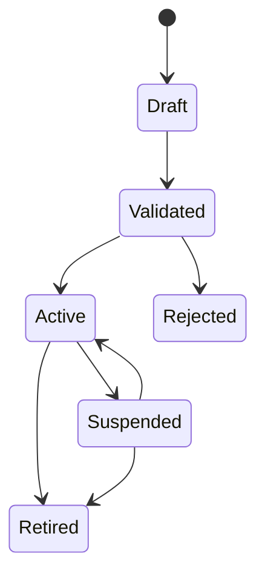

# Pruebas, seguridad y gobierno de modelos

## 1. Propósito

El Laboratorio manejará información financiera personal y mostrará cálculos que pueden influir en decisiones relevantes. La calidad no puede limitarse a «la página carga». Este documento define:

- estrategia de pruebas;
- exactitud numérica;
- validación de modelos;
- controles de datos;
- autorización y privacidad;
- seguridad de infraestructura;
- lenguaje y riesgo de automatización;
- monitorización;
- puertas de lanzamiento;
- respuesta a incidentes.

## 2. Principios

1. Probar la definición antes que la implementación.
2. Comparar modelos complejos con baselines simples.
3. Probar invariantes, no solo ejemplos.
4. Usar datos sintéticos o autorizados en fixtures.
5. Un test no puede generar su expected mediante el mismo código.
6. Los resultados numéricos tienen tolerancias justificadas.
7. Las pruebas de RLS incluyen casos negativos.
8. Backtest y producción comparten transforms.
9. Un modelo puede dar no-go.
10. Una salida no concluyente es válida.
11. Seguridad, accesibilidad y copy son puertas, no tareas cosméticas.
12. Los datos y modelos caducan.

## 3. Pirámide de pruebas

| Nivel | Propósito | Frecuencia |
|---|---|---|
| Unitarias puras | fórmulas, schemas, reglas | cada PR |
| Propiedades/metamórficas | invariantes matemáticas | cada PR relevante |
| Contrato | proveedores, Edge API, DB mapping | cada PR relevante |
| Integración | store, IndexedDB, Supabase local, workers | cada PR relevante |
| pgTAP/RLS | integridad y autorización | cada migración |
| E2E core | recorridos esenciales | cada PR/main |
| E2E amplio | browsers, móvil, fallos | nightly/release |
| Regresión cuantitativa | golden/model fixtures | cada cambio de motor |
| Backtest walk-forward | validez de señal/modelo | antes de activar |
| Rendimiento/carga | presupuestos | release y cambios estructurales |
| Seguridad | SAST, dependencias, threat tests | continuo/release |
| Accesibilidad | automático + manual | cada pantalla/release |
| Comprensión | test de usuarios | beta/revisión |

## 4. Organización de pruebas

Estructura orientativa:

```text
src/
  lib/
    lab/
      analytics/__tests__/
      data/__tests__/
      schemas/__tests__/
      explanations/__tests__/
  features/
    lab/**/__tests__/
  test/
    fixtures/
    builders/
    matchers/
supabase/
  tests/
    database/
    rls/
    functions/
e2e/
  lab/
validation/
  datasets/
  configs/
  expected/
```

Los datasets grandes o con licencia no se comprometen. Se guardan hashes, generadores o referencias seguras.

## 5. Exactitud numérica

## 5.1 Política de números

- Dinero transaccional: Decimal.
- Retornos/matrices: double con comprobación.
- Prohibidos NaN e Infinity en contratos.
- Redondeo: presentación.
- Pesos: internamente proporción 0–1.
- Porcentajes: conversión en view model.
- Pérdidas: convención documentada por campo.

## 5.2 Tolerancias

Cada matcher define:

- tolerancia absoluta;
- tolerancia relativa;
- escala;
- justificación.

Ejemplo orientativo:

$$
|\mathrm{actual}-\mathrm{expected}|
\le \mathrm{atol} + \mathrm{rtol}\,|\mathrm{expected}|
$$

No usar una tolerancia grande para ocultar inestabilidad. Los optimizadores pueden necesitar tolerancia mayor que una suma simple, pero deben reportar:

- residual de suma de pesos;
- violation máxima;
- status del solver;
- error objetivo;
- iteraciones.

## 5.3 Fixtures mínimos

### A. Dos activos independientes

- varianzas conocidas;
- covarianza cero;
- pesos 50/50;
- resultado manual.

### B. Dos activos idénticos

- correlación 1;
- matriz singular;
- optimizador debe manejar o rechazar de forma controlada.

### C. Activo constante

- varianza cero;
- correlación indefinida;
- no convertirla en 0 sin warning.

### D. FX

- retorno local;
- retorno FX;
- conversión multiplicativa.

### E. Fechas ausentes

- calendarios distintos;
- cierre de mercado;
- datos realmente ausentes.

### F. Drawdown

- pico, caída, recuperación;
- caída sin recuperar;
- serie siempre creciente.

### G. Restricciones

- factible;
- infeasible;
- locked;
- group cap;
- contributions-only.

### H. Point-in-time

- dato observado antes, publicado después;
- restatement;
- delisting.

## 5.4 Propiedades

### Concentración

- $1/n \le \mathrm{HHI} \le 1$ para long-only normalizado.
- N efectivo entre 1 y n.
- permutar activos no cambia HHI.

### Covarianza/correlación

- simetría;
- diagonal de covarianza = varianza;
- diagonal de correlación = 1 solo si varianza válida;
- PSD dentro de tolerancia para estimador que lo garantice;
- escalar una serie ajusta covarianza de forma esperada.

### Riesgo

- varianza de cartera no negativa;
- Euler: suma de contribuciones ≈ riesgo;
- permutar simultáneamente pesos y matriz no cambia resultado;
- un peso cero tiene contribución absoluta cero, salvo definición distinta explícita.

### Escenarios

- shock cero → pérdida cero antes de costes;
- misma semilla → mismo resultado;
- número de trayectorias no cambia inputs;
- aportación positiva aumenta valor contable ceteris paribus;
- coste no aumenta valor.

### Optimización

- pesos suman uno;
- límites;
- grupos;
- turnover;
- status válido;
- objetivo de mínima varianza no peor que una solución factible evaluada por el mismo objetivo, dentro de tolerancia, salvo convergencia declarada.

### Look-through

- exposición suma directa + expandida + no cubierta;
- orden de holdings no cambia;
- ciclo termina;
- overlap simétrico.

## 6. Validación independiente

Para cada motor crítico:

1. Caso manual.
2. Segunda implementación temporal o notebook.
3. Comparación con biblioteca reconocida cuando la licencia permita.
4. Fixture congelado.
5. Revisión por persona distinta o sesión independiente.

No llevar el notebook experimental a producción como dependencia implícita. Guardar:

- versión de biblioteca;
- parámetros;
- hash de datos;
- resultado;
- diferencia.

## 7. Pruebas de datos

## 7.1 Ingesta

Validar:

- schema;
- tipos;
- moneda;
- unidades;
- timezone;
- duplicados;
- orden;
- gaps;
- valores imposibles;
- cambios de proveedor;
- rate limit;
- retry;
- correcciones.

## 7.2 Series

Checks:

- fechas monótonas;
- un valor por clave;
- precios >0 cuando aplica;
- retornos finitos;
- split extremo identificado;
- no mezclar ajuste;
- FX con orientación;
- calendario.

## 7.3 Clasificación y holdings

- pesos razonables;
- total/cobertura;
- otros;
- identidad;
- ciclos;
- validFrom/to;
- taxonomía;
- cambio de sector.

## 7.4 Fundamentales

- periodo;
- availableAt;
- unidad;
- moneda;
- TTM;
- revisión;
- signos;
- consolidación.

## 7.5 Alertas

Un check produce:

- code;
- dataset;
- severity;
- observed;
- threshold;
- asOf;
- owner;
- next action.

El fallo de calidad puede:

- excluir una observación;
- degradar resultado;
- bloquear cálculo;
- bloquear publicación.

La acción se define por check, no en UI.

## 8. Pruebas de contratos de proveedor

Cada adaptador:

- usa fixtures redacted/autorizados;
- valida respuesta nominal;
- campo ausente;
- campo extra;
- cambio de tipo;
- HTTP 4xx/5xx;
- timeout;
- rate limit;
- payload enorme;
- fecha inesperada;
- valor nulo;
- símbolo ambiguo.

Un proveedor alternativo solo puede reemplazar al primario si la semántica coincide: ajuste, divisa, frecuencia y cobertura.

Las pruebas live:

- son pocas;
- no bloquean todos los PR por disponibilidad externa;
- se ejecutan programadas;
- no imprimen claves/respuestas sensibles;
- alertan por drift de contrato.

## 9. Pruebas de UI

## 9.1 Componentes

Para cada componente analítico:

- dato válido;
- parcial;
- stale;
- vacío;
- error;
- valor cero legítimo;
- valor negativo;
- número grande;
- label largo;
- móvil;
- teclado.

## 9.2 Gráficos

- dominio y escala;
- serie vacía;
- una observación;
- huecos;
- tooltip;
- leyenda;
- tabla equivalente;
- no depender de color;
- captura estable solo si aporta.

No usar snapshots visuales como única prueba de significado.

## 9.3 E2E esenciales

### Recorrido A: modo local

1. Cargar sin Supabase.
2. Abrir demo.
3. Entrar a Laboratorio.
4. Ver estabilidad.
5. Crear estrés.
6. Guardar local.
7. Recargar.

### Recorrido B: IPS

1. Crear draft.
2. Completar objetivo.
3. Crear conflicto.
4. Revisar.
5. Activar.
6. Editar y generar versión.

### Recorrido C: cloud

1. Sesión de test.
2. Sincronizar.
3. Ejecutar run.
4. Consultar.
5. Logout.
6. Verificar limpieza.

### Recorrido D: datos parciales

1. ETF sin holdings.
2. activo sin historia.
3. ver calidad.
4. cálculo parcial.
5. métrica bloqueada.

### Recorrido E: cartera cripto/tech

1. Hallazgo de concentración.
2. dependencia.
3. reparación.
4. shock.
5. candidata.
6. sector.

### Recorrido F: seguridad

1. usuario A crea run.
2. usuario B intenta URL/ID.
3. API deniega.
4. UI no filtra metadata.

## 10. Accesibilidad

## 10.1 Automática

- eslint JSX a11y;
- axe en componentes/páginas;
- contraste automatizable;
- landmarks;
- labels.

## 10.2 Manual

- tab/shift-tab;
- focus trap de drawers/modals;
- lector de pantalla;
- headings;
- error summary;
- zoom;
- reflow;
- reduced motion;
- heatmap;
- tablas sticky;
- gráficos.

## 10.3 Criterios especiales

- final de run se anuncia sin interrumpir;
- polling no mueve foco;
- matriz tiene tabla;
- celdas de color tienen valor textual;
- iconos con significado tienen label;
- slider tiene input alternativo;
- comparación móvil no requiere gesto oculto.

## 11. Pruebas de persistencia local

- migración desde STORE_VERSION actual;
- datos desconocidos;
- JSON corrupto;
- cuota excedida;
- IndexedDB no disponible;
- múltiples tabs;
- logout;
- usuario A/B;
- actualización de schema;
- export/import;
- stale TTL.

El fallback por corrupción:

1. conservar copia recuperable;
2. iniciar estado seguro;
3. informar;
4. no enviar el contenido a telemetry.

## 12. Pruebas PostgreSQL y RLS

## 12.1 Por tabla privada

- SELECT propio;
- INSERT propio;
- UPDATE propio;
- DELETE propio;
- SELECT ajeno;
- UPDATE ajeno;
- referencia FK a entidad ajena;
- anon;
- JWT sin claim;
- service role solo en test controlado.

## 12.2 Jerarquías

No basta policy por tabla hija. Probar:

- snapshot_position con snapshot ajeno;
- goal con policy ajena;
- result con run ajeno;
- comparison con run ajeno;
- watchlist con signal global pero owner privado.

## 12.3 Funciones

Para `security definer`:

- `search_path` fijo;
- argumentos manipulados;
- privilegios revocados a public;
- ownership revalidado;
- SQL injection;
- retorno mínimo.

## 12.4 Migraciones

- aplicar desde cero;
- aplicar desde versión previa con fixture;
- idempotencia de backfill;
- locks/tiempo;
- índices;
- defaults;
- rollback lógico;
- tipos generados.

No editar una migración aplicada para que CI pase.

## 13. Pruebas de Edge Functions

- JWT ausente/inválido/caducado;
- CORS;
- schema version;
- payload > límite;
- NaN/infinito representado mal;
- snapshot ajeno;
- idempotencia;
- retry;
- timeout;
- provider error;
- service error;
- estado de run;
- redacción;
- rate limit;
- cancelación.

Fuzzing dirigido en:

- arrays de pesos;
- restricciones;
- IDs;
- campos libres;
- scenario definitions.

## 14. Threat model

## 14.1 Activos a proteger

- carteras/transacciones;
- perfil y objetivos;
- tokens;
- claves de proveedor;
- service role;
- integridad de precios;
- modelos;
- señales publicadas;
- cadena CI/CD;
- auditoría.

## 14.2 Amenazas principales

| Amenaza | Control |
|---|---|
| IDOR/acceso cruzado | RLS + ownership backend + tests A/B |
| XSS mediante nombres/importaciones | escape React, sanitización y CSP viable |
| CSV injection | prefijado/escape y advertencia |
| Supply chain | lockfile, SHA de Actions, dependency review |
| Secreto en bundle | scan de dist y regla `VITE_*` |
| Manipulación de señal | model registry, roles, hash, audit |
| Provider poisoning/error | validación, rangos, fuentes, circuit breaker |
| Prompt injection | LLM allowlist, datos como datos, salida validada |
| DoS de cálculo | límites, timeout, cola, rate limit |
| Replay/duplicación | idempotency key |
| Caché entre usuarios | namespace y limpieza |
| Log leakage | redacción y tests |
| Migración destructiva | expand/contract y backup |

## 14.3 Abuso específico financiero

- introducir pesos negativos fuera del contrato;
- precios manipulados manualmente;
- seleccionar fecha futura;
- usar señal caducada;
- forzar un modelo retirado;
- alterar universo mediante IDs;
- comparar runs con moneda distinta sin advertencia;
- crear una solución infeasible;
- omitir un activo para reducir riesgo mostrado.

La aplicación conserva provenance manual y porcentaje excluido.

## 15. Privacidad y minimización

### 15.1 Pruebas

- telemetry no contiene importes/tickers;
- errores no contienen payload;
- exports solo del usuario;
- logout borra cache privada;
- borrado de cuenta;
- retención;
- backups;
- DSAR/export si aplica.

### 15.2 Datos de desarrollo

- no copiar producción;
- generar fixtures sintéticos;
- anonimización no reversible si excepcional;
- acceso mínimo;
- caducidad.

## 16. Gobierno de modelos

## 16.1 Qué se considera modelo

- estimador de covarianza;
- clustering;
- escenario estocástico;
- optimizador;
- regla de riesgo efectiva;
- ranking sectorial;
- ranking empresarial;
- explicación LLM.

Una regla determinista también necesita versión si cambia una conclusión.

## 16.2 Ficha de modelo

Cada versión:

- nombre/key;
- owner;
- propósito;
- uso permitido;
- uso prohibido;
- datos;
- transformaciones;
- supuestos;
- parámetros;
- código SHA;
- schema;
- validación;
- límites;
- métricas;
- fecha;
- status;
- monitorización;
- rollback;
- próxima revisión.

## 16.3 Ciclo



Solo Active atiende runs nuevos de producción. Runs antiguos conservan referencia.

## 16.4 Separación de funciones

Ideal:

- desarrollador;
- validador;
- aprobador;
- operador.

En un proyecto individual no siempre habrá cuatro personas. Como mínimo:

- sesión/artefacto independiente de validación;
- checklist;
- revisión diferida;
- datos holdout;
- decisión documentada.

## 17. Validación de estabilidad/riesgo

### 17.1 Covarianza

Comparar:

- muestra;
- shrinkage;
- EWMA si aplica.

Medir:

- condition number;
- PSD;
- error fuera de muestra;
- estabilidad de contribuciones;
- sensibilidad a ventana.

### 17.2 Downside

- tamaño de cola;
- estabilidad por bootstrap;
- niveles;
- frecuencia;
- comportamiento con clusters;
- límites de interpretación.

### 17.3 Clustering

- estabilidad de asignación;
- linkage;
- sensibilidad;
- significado no causal;
- clusters singleton.

## 18. Validación de escenarios

### Deterministas

- exactitud aritmética;
- cobertura;
- composición;
- shocks combinados;
- signos.

### Históricos

- fechas;
- total return/FX;
- activos sin historia;
- «cartera actual en periodo pasado».

### Bootstrap

- reproducibilidad;
- conservación de dependencia;
- distribución marginal;
- block size;
- autocorrelación;
- convergencia por número de trayectorias;
- sensibilidad.

### Goal simulation

- flujos;
- inflación;
- costes;
- rebalanceo;
- definición de éxito;
- no llamar probabilidad objetiva sin calibración.

## 19. Validación de optimizadores

## 19.1 Baselines

- actual;
- 1/N;
- aportaciones;
- límite simple.

## 19.2 Dentro de muestra

Solo para sanity:

- objetivo;
- constraints;
- status;
- esquina;
- condición.

## 19.3 Fuera de muestra

Walk-forward:

1. estimar en ventana;
2. resolver;
3. aplicar en periodo siguiente;
4. costes;
5. repetir.

Medir:

- volatilidad;
- CVaR;
- drawdown;
- turnover;
- concentración;
- violaciones;
- estabilidad de pesos;
- error de estimación;
- comparación baseline.

## 19.4 Prueba de perturbación

- $\mu$;
- $\Sigma$;
- límites;
- costes;
- universo;
- fecha.

Una candidata «robusta» necesita criterio cuantitativo, no solo etiqueta.

## 19.5 Aceptación

No exigir que gane siempre. Exigir:

- comportamiento coherente con objetivo;
- restricciones;
- transparencia;
- estabilidad razonable;
- no degradación material inexplicada frente a baseline.

## 20. Validación de señales

## 20.1 Anti-lookahead

- availableAt;
- lag;
- revisiones;
- universo histórico;
- corporate actions;
- delistings;
- calendario.

Crear tests que introduzcan deliberadamente dato futuro y verifiquen exclusión.

## 20.2 Diseño experimental

- hipótesis antes de mirar holdout;
- train/development;
- validation;
- holdout final;
- walk-forward;
- múltiples periodos/regiones si procede;
- costes;
- benchmark;
- corrección por múltiples pruebas o, como mínimo, registro de experimentos.

## 20.3 Métricas

- information coefficient;
- rank stability;
- top-minus-bottom;
- retorno/riesgo;
- drawdown;
- turnover;
- cobertura;
- porcentaje excluido;
- resultados por régimen;
- intervalos bootstrap.

## 20.4 Sesgos

- supervivencia;
- lookahead;
- selección de universo;
- publicación;
- data snooping;
- revisions;
- cambio de taxonomía;
- proxies actuales para pasado;
- costes omitidos.

## 20.5 Go/no-go

Definir antes:

- cobertura mínima;
- estabilidad;
- turnover máximo;
- degradación permitida;
- evidencia fuera de muestra;
- drawdown;
- comportamiento en subperiodos;
- disponibilidad operativa.

Un rendimiento alto con cobertura pobre no pasa.

## 21. Monitorización de modelos

### 21.1 Datos

- freshness;
- missing;
- outliers;
- distribución;
- universo;
- provider drift;
- clasificación.

### 21.2 Output

- distribución de scores;
- concentración de rankings;
- turnover;
- soluciones infeasible;
- pesos en límites;
- volatilidad estimada;
- dispersión de simulación;
- explanation failures.

### 21.3 Performance diferida

Cuando haya realizaciones:

- error de riesgo;
- calibración de escenarios con cautela;
- IC;
- benchmark;
- cambios por régimen.

No cambiar modelo automáticamente por una semana de bajo rendimiento.

### 21.4 Acciones

- warning;
- bloquear publicación;
- suspender versión;
- volver a anterior;
- investigar provider;
- revalidar.

## 22. Uso de IA/LLM

ESMA ha señalado riesgos de sesgo, calidad de datos, opacidad, sobredependencia y privacidad en el uso de IA en servicios de inversión. El diseño debe aplicar:

- explicación con evidencia;
- supervisión;
- límites;
- testing;
- privacidad;
- fallback.

Referencia: [ESMA — guidance on AI in investment services](https://www.esma.europa.eu/press-news/esma-news/esma-provides-guidance-firms-using-artificial-intelligence-investment-services).

### 22.1 Test suite LLM

- altera un número;
- omite advertencia;
- convierte escenario en predicción;
- recomienda comprar;
- inventa fuente;
- prompt injection en nombre de activo;
- contenido multilingüe;
- datos incompletos;
- modelo no disponible.

### 22.2 Criterio

Si falla:

- descartar;
- usar explicación determinista;
- registrar código, no contenido sensible;
- no mostrar respuesta parcial.

## 23. Copy, idoneidad y regulación

### 23.1 Checklist de lenguaje

- [ ] Hecho con fecha.
- [ ] Estimación con método.
- [ ] Escenario condicional.
- [ ] Señal con caducidad.
- [ ] Sugerencia como investigación.
- [ ] No «seguro/garantizado».
- [ ] No «debes comprar».
- [ ] No retorno prometido.
- [ ] Limitación visible.
- [ ] Conflicto de perfil explicado.

### 23.2 Perfil

Pruebas:

- tolerancia alta/capacidad baja;
- necesidad alta/capacidad baja;
- horizonte corto;
- liquidez insuficiente;
- experiencia baja;
- restricción incompatible.

La salida no aumenta automáticamente riesgo. Tomar como referencia los elementos de idoneidad de [ESMA/MiFID II, artículo 25](https://www.esma.europa.eu/publications-and-data/interactive-single-rulebook/mifid-ii/article-25-assessment-suitability-and).

### 23.3 Revisión humana

Antes de personalización pública:

- mercado/jurisdicción;
- naturaleza educativa o asesoramiento;
- disclaimers;
- onboarding;
- almacenamiento de perfil;
- explicación;
- marketing;
- exportaciones.

## 24. Rendimiento

### Frontend

- tamaño inicial/chunk;
- LCP/INP/CLS;
- render de tabla/matriz;
- memoria;
- worker;
- cancelación;
- navegación.

### Backend

- p50/p95/p99;
- cold start;
- DB queries;
- pool/conexiones;
- payload;
- cola;
- concurrency;
- proveedor;
- retry amplification.

### Cálculo

- n activos;
- T observaciones;
- simulaciones;
- perturbaciones;
- solver iterations;
- timeout.

Resultados de benchmark incluyen hardware/runtime y commit.

## 25. Resiliencia

Chaos/failure tests:

- proveedor caído;
- respuesta lenta;
- rate limit;
- Supabase no disponible;
- IndexedDB falla;
- worker muere;
- run queda running;
- cron duplica;
- signal publish parcial;
- model service timeout;
- red intermitente;
- sesión expira.

Comportamiento esperado:

- conservar último válido;
- marcar stale;
- cancelar/reintentar limitado;
- idempotencia;
- mensaje accionable;
- no duplicar/corromper.

## 26. Matriz de severidad

| Severidad | Ejemplo | Acción |
|---|---|---|
| S0 crítica | acceso cruzado, secreto, cálculo materialmente falso publicado | desactivar/contener inmediato |
| S1 alta | señal con lookahead, pérdida de datos, RLS vulnerable | bloquear release/feature |
| S2 media | métrica parcial mal etiquetada, E2E roto secundario | corregir antes de release o excepción |
| S3 baja | copy, layout menor | backlog con fecha |

Un error numérico no se clasifica por tamaño de código, sino por impacto en conclusión.

## 27. Checklist por PR

### General

- [ ] Alcance LAB-xxx.
- [ ] Tests relevantes.
- [ ] Lint/tipos/build.
- [ ] Sin cambios ajenos.
- [ ] Documentación.

### Datos

- [ ] Fuente/provenance.
- [ ] Fecha/freshness.
- [ ] Missing.
- [ ] Schema.
- [ ] Licencia.

### Cuantitativo

- [ ] Fórmula.
- [ ] Fixture.
- [ ] Propiedades.
- [ ] Tolerancia.
- [ ] Baseline.

### Backend

- [ ] Auth.
- [ ] Ownership.
- [ ] RLS.
- [ ] Idempotencia.
- [ ] Rate/timeout.
- [ ] Logs redacted.

### UI

- [ ] loading/empty/partial/stale/error.
- [ ] móvil.
- [ ] teclado.
- [ ] evidencia.
- [ ] copy.

## 28. Checklist de release por capability

### Estabilidad

- [ ] paridad;
- [ ] downside validado;
- [ ] cobertura;
- [ ] ventanas;
- [ ] rendimiento;
- [ ] explicación.

### Look-through

- [ ] licencia;
- [ ] vigencia;
- [ ] coverage;
- [ ] unknown/otros;
- [ ] ciclos;
- [ ] lineage.

### Escenarios

- [ ] definición;
- [ ] seed;
- [ ] costes;
- [ ] sensibilidad;
- [ ] wording;
- [ ] reproducibilidad.

### Candidatas

- [ ] constraints;
- [ ] infeasibility;
- [ ] baseline;
- [ ] solver;
- [ ] robustez;
- [ ] fuera de muestra.

### Sectores

- [ ] point-in-time;
- [ ] universe;
- [ ] backtest;
- [ ] holdout;
- [ ] model registry;
- [ ] freshness;
- [ ] no-go explícito.

### Empresas

- [ ] G8;
- [ ] fundamentals;
- [ ] delistings;
- [ ] liquidity;
- [ ] redundancy;
- [ ] review.

## 29. Gate final

Un capability solo se activa si:

1. sus tests automáticos pasan;
2. no hay S0/S1 abiertos;
3. datos y licencia son suficientes;
4. validación cuantitativa está aprobada;
5. RLS/autorización pasan;
6. copy y accesibilidad pasan;
7. monitorización y rollback existen;
8. owner acepta operación;
9. feature flag permite retirar;
10. no contradice el alcance jurídico aprobado.

## 30. Respuesta a incidentes

### 30.1 Secuencia

1. Detectar.
2. Clasificar.
3. Contener.
4. Preservar evidencia.
5. Corregir/rollback.
6. Validar.
7. Comunicar.
8. Postmortem.

### 30.2 Incidente de modelo

- suspender versión;
- impedir nuevos runs;
- conservar históricos con aviso;
- activar anterior;
- identificar usuarios/runs afectados sin filtrar datos;
- corregir validation report;
- no borrar evidencia.

### 30.3 Incidente de datos

- bloquear publicación;
- marcar resultados afectados;
- fijar rango temporal/provider;
- recalcular solo tras corrección;
- mantener original y corrected lineage.

### 30.4 Acceso cruzado

- cortar endpoint/política;
- revocar tokens/secrets si procede;
- preservar logs;
- evaluar alcance;
- seguir obligaciones de notificación aplicables;
- prueba de no regresión antes de restaurar.

## 31. Evidencia de cierre

Para cada gate guardar:

- commit;
- environment;
- test reports;
- coverage;
- validation report;
- dataset hashes;
- model version;
- security/accessibility review;
- decisión;
- aprobador;
- fecha;
- excepciones y expiración.

Sin esta evidencia, la fase puede estar «implementada», pero no «aprobada».
